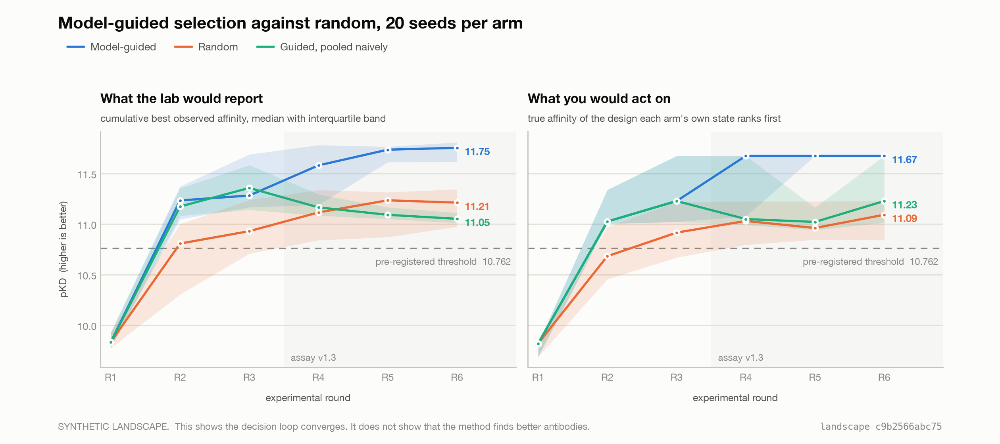

# Adaptive Optimization Workbench

A one-day functional prototype of a scientist-governed system that takes an antibody
lead, learns from each round of experimental results, and recommends the next batch of
variants to test.

Read `SPEC.md` for the full specification, `CLAUDE.md` for the working rules, and
`DECISIONS.md` for every choice already settled and why.

> **Everything about the laboratory is simulated.** The landscape is synthetic, the LIMS
> is a mock, and the wet lab is an oracle that replays generated values with noise. The
> chart this produces demonstrates that the decision loop works — it does not demonstrate
> that the method finds better antibodies. See the staged table at the bottom.

**The problem is borrowed from the literature; the numbers are not.** The lead is
trastuzumab VH, the editable window is eight CDR-H3 positions, and the mutation budget is
two — which is the combinatorial design of the `trast-1` dataset in [Bachas et al.
2022](https://www.biorxiv.org/content/10.1101/2022.08.16.504181v1.full), where 8,932
trastuzumab variants spanning up to two substitutions across eight CDR-H3 positions were
measured by a high-throughput cell-sorting assay. Their space excludes cysteine as a
substitution and comes to 9,217 sequences; this one allows all twenty letters, comes to
10,261, and filters cysteine out downstream as a declared liability. The shape is the
same deliberately, so that replacing `data/oracle.py` with a loader over real
measurements changes one file and no science — see *Where this sits in the literature*
at the bottom. **What is borrowed is the design space. Every affinity value in this repo
is generated by `data/synthetic.py`.**

## Setup

numpy is the only dependency of `core/`, and that is a design constraint rather than an
oversight — not because scipy cannot run in the browser, which it can, but because
`core/` is the part an audience is invited to read. matplotlib is an *evaluator*
dependency, used by `plot_campaign.py` and nothing on a product path. The Model
Context Protocol SDK arrived with phase 5 and is a *connector* dependency: the two
servers in `connectors/` import it, `check.py` drives them with its client, and nothing
in `core/` has heard of it.

```bash
python3.12 -m venv .venv
.venv/bin/pip install numpy matplotlib mcp
.venv/bin/python check.py      # 188 invariant checks, all should pass
```

`.venv/` is gitignored. Everything else needed — including the generated landscape — is
committed, so a fresh clone plus the two commands above reproduces the current state.

**Use `.venv/bin/python`, not `python3`.** The system interpreter has no numpy.

## What runs today

```bash
.venv/bin/python -m data.build_oracle        # regenerate the landscape (deterministic)
.venv/bin/python simulate_campaign.py        # the evaluator: 20 seeds, 3 arms, chart, ~35 s
.venv/bin/python plot_campaign.py            # re-render the chart alone, ~1 s
.venv/bin/python check.py                    # verify every documented invariant, ~32 s
```

And the product path, which is the same science through the CLI:

```bash
.venv/bin/python init_project.py --name demo-trastuzumab --team d.webster --force
.venv/bin/python run_rounds.py --rounds 4 --approved-by d.webster
.venv/bin/python lims.py tools               # the LIMS write path, which is the boundary claim
```

The registry also owns two reads that a real LIMS unambiguously owns, and that the web
app's lab round trip is built on. A scripted campaign never waits, because `--stagger` is
off by default and `run_rounds.py` does not pass it:

```bash
.venv/bin/python lims.py export --project projects/demo-trastuzumab --round R4     --out /tmp/order.csv        # the order the lab receives: no value column
.venv/bin/python lims.py status --project projects/demo-trastuzumab --round R4
.venv/bin/python lims.py release --project projects/demo-trastuzumab --round R4   # simulated: the assay reports now
```

`release` is the one command here that is a demo device rather than a registry tool, and
it is the only thing in the repository that moves the laboratory's clock. It marks a held
run reported and writes who said so; the values were measured at submission either way.

`run_rounds.py` is a deliberately dumb scheduler over the five pipeline scripts. It prints
every command it runs and **stops** the moment a round is flagged, because that is where
the judgment is. It stops twice in four rounds, and it prints the commands that resume it.
`--ignore-flags` carries on without a ruling, which is the naive-pooling arm of the chart.

And the part a scheduler cannot do, which is what the skill is for:

```bash
S=skills/adaptive-optimization/scripts
.venv/bin/python $S/run_diagnostic.py  --project projects/demo-trastuzumab --round 4 \
    --test calibration_by_region --offset bridge          # read-only, writes nothing
.venv/bin/python $S/record_decision.py --project projects/demo-trastuzumab --round 2 \
    --propose diagnosis.json                              # the agent proposes
.venv/bin/python $S/record_decision.py --project projects/demo-trastuzumab --round 2 \
    --rule accepted --by d.webster --note "..."           # a named human disposes
```

And the same two boundaries as connectors, which is how an agent reaches them:

```bash
.venv/bin/python connectors/registry_server.py --tools      # the boundary claim, printed
.venv/bin/python connectors/bioprovider_server.py --tools   # and what it will not fake
claude                                                      # .mcp.json loads both
```

`.mcp.json` registers both servers, so opening this repo in Claude Code connects them
with no further setup.

And the same science again in a browser, with no server and no key:

```bash
cd web && npm install && npm run sync   # copy core/ into the bundle, stage Pyodide
npm run dev                             # http://localhost:5173
npm run build                           # static output in web/dist, ~19 MB
node scripts/pyodide-check.mjs          # run the browser's Python path without a browser
```

`npm run sync` is two steps. `python ../web/bundle.py` copies `core/`, `data/`, `lims.py`
and the seven skill scripts into `web/public/workbench/` byte for byte, in the repo's own
directory shape, with a sha256 per file; `check.py` fails if any of them drifts. It also
writes `SKILL.md` into `web/function/lib/skill.mjs`, which is the model's system
prompt, and `check.py` fails if that string is not the file. `scripts/stage-pyodide.mjs`
puts the Python runtime and the numpy wheel on this site's own origin, checking the wheel
against pyodide's lock file before writing it.

And the model in the centre seat, which is a live seat only when the site's one function
has a key. The dev server mounts the function at the path Vercel serves it from, `/api/ask`:

```bash
cd web && ANTHROPIC_API_KEY=sk-ant-... npm run dev   # live: Sonnet 5 diagnoses in the session
cd web && npm run dev                                # no key: the page stays in replay, says so
node scripts/ask-check.mjs                           # what the function refuses, without a key
node scripts/pyodide-check.mjs                       # replay, push-back, and the loop, scripted
```

`WORKBENCH_DAILY_CAP_USD`, `WORKBENCH_IP_CAP` and `WORKBENCH_IN_FLIGHT_CAP` bound the
spend, reserved before each call rather than counted after it; the function's probe
reports where the day stands. `WORKBENCH_ACCESS_CODE`, when set, closes the live seat to
any page that did not get the code from its link (`?code=…` before the hash; the page
keeps it and takes it off the address bar). `WORKBENCH_UPSTREAM=scripted` swaps the model
for the harness's test double, which the probe and every turn's badge report as such.

Installing the same skill and connectors elsewhere uses the host's own distribution
mechanism, described in the host's own words — *"Save any pipeline as a reusable skill,
or connect to your lab's preferred tool with a connector, and every future session
inherits it automatically."* That sentence is the argument that this is an extension
rather than a rival, and it is not ours:

```bash
claude plugin marketplace add /path/to/adaptive-workbench
claude plugin install adaptive-optimization@adaptive-workbench
```

The plugin bundles `skills/adaptive-optimization/` and both connectors. **Both commands
above have been run**, and from an unrelated directory `claude mcp list` then reports
`plugin:adaptive-optimization:registry` and `:bioprovider` as connected, with
`${CLAUDE_PLUGIN_ROOT}` expanded to this repo. Remove it again with `claude plugin
uninstall adaptive-optimization@adaptive-workbench`.

The plugin needs the `.venv` beside it, because the connectors are Python and the
interpreter they name is that one. Claude Science does not run them on those terms, and
what it does run them on is the next section.

### Installing into Claude Science

Claude Science is a local application — installed on macOS or Linux, its data under
`~/.claude-science`, opening in a browser tab — so it runs the same Python stdio
connectors Claude Code runs. What it has no installer for is the *bundle*: the skill and
the two connectors go in as three separate acts, one of which is a hand-written
configuration file. Every step below has been run.

**The skill, once.** `Settings > Credentials` takes a GitHub token — fine-grained, with
the resource owner set to the organization that owns the repository, `Contents:
Read-only`, and the `Metadata: Read-only` GitHub pairs with it automatically. Nothing
else. Then `Settings > Skills > Add skill > Import from GitHub`. The host reads
`.claude-plugin/marketplace.json`, resolves `skills/adaptive-optimization` out of it, and
records the commit it came from beside the copy it keeps:

```json
{"repo": "cooperstlogic/adaptive-workbench",
 "sha": "db99c082de4da87c682c5a8ce2b23cebaa1f795f",
 "plugin": "adaptive-optimization", "marketplace": "adaptive-workbench",
 "path": "skills/adaptive-optimization"}
```

The marketplace manifest is therefore read for the skill and ignored for the connectors.
The same file declares both; one of them installs from it.

**Each connector, by hand.** `Settings > Connectors > Add connector > Local command`, then
a name and one command line. There is no separate arguments field — the box takes the
whole line, as its `npx -y @modelcontextprotocol/server-memory` placeholder shows.

| Name | Command |
| --- | --- |
| `registry` | `python /path/to/adaptive-workbench/connectors/registry_server.py` |
| `bioprovider` | `python /path/to/adaptive-workbench/connectors/bioprovider_server.py` |

`python` stays bare. The host resolves it to its own bundled environment
(`~/.claude-science/conda/envs/claude-science-mcp`, Python 3.13, carrying `mcp` and
`numpy`); an absolute path to this repo's `.venv` is refused before the process starts.

**The sandbox grant, once.** The connectors are files in this repository, and the MCP
sandbox cannot see this repository. Write `~/.claude-science/config.toml`, with real
absolute paths:

```toml
[sandbox]
user_read_paths  = ["/path/to/adaptive-workbench"]
user_write_paths = ["/path/to/adaptive-workbench/lims_store"]
```

Read covers `connectors/`, `core/`, `lims.py` and the project directory. Write is granted
to exactly one directory — the mock LIMS's own store — and to nothing else. Reads and
writes are gated separately, so a read grant alone loads the tools and then fails on the
first `submit_batch`. The file is read once at startup, so quit the app from the menu bar
icon and relaunch; closing the browser tab is not enough. Neither key appears in the
published configuration reference: the error message names `user_read_paths`, and
`user_write_paths` sits beside it in the application's own schema.

Then `registry` lists its five tools and `bioprovider` its three.

**Four failures, each of which hid the next.** Only the first and the last say what is
wrong, which is why they are written down here.

| What you see | What it is |
| --- | --- |
| `sandbox-exec: execvp() of '…/.venv/bin/python' failed: Operation not permitted` | The sandbox will not exec a binary in your home directory. Use the bare name `python` |
| Tools load forever; nothing in any log | The command box held an interpreter and no script, so a bare Python read the JSON-RPC stream as a program and answered nothing. A missing argument produces no error and no timeout |
| `ModuleNotFoundError: No module named 'mcp.server.mcpserver'` | The host's environment carries `mcp` 1.x; this repo's `.venv` carries 2.x, where `FastMCP` was renamed to `MCPServer`. Both connectors now import whichever is present — decision 101 |
| `… exists on this machine but is not visible inside the MCP sandbox` | The `config.toml` grant above, and a restart |

`~/.claude-science/mcp/local-mcp.json` records what the dialog actually saved, and it
identified two of the four faults faster than the interface did.

A system path (`/usr`, `/opt`, `/bin`, `/nix` are readable by default) removes the need
for the read grant and is the wrong trade here: it grants no writes, it needs root for a
live git tree, and it splits the project directory in two, which is the one thing demo
beat 5 cannot survive — the batch hashes only mean something if both surfaces read the
same state.

`check.py` runs 188 checks in about forty seconds and is the handoff contract. Every
check in it corresponds to a rule in `CLAUDE.md` or a number recorded in `DECISIONS.md`,
so a failure means the state has drifted from what is documented.

## How the modelling and the adaptive loop work

This is the centre of the build, so it is written out in full. Every piece below is a
file in `core/`, and none of it is more than a page of numpy.

### The state that makes it adaptive

A project is a directory of JSON files that carries forward from round to round: the
designs ordered, the measurements returned, the model fit each time, the batch selected,
and any decision a human ruled on. Nothing is held in memory between rounds and nothing
is held in a database. *Adaptive* here means only this — **round N's choice is a function
of rounds 1 through N−1's results**, and that function is written down and hashed.

### Step 1 — the design space, enumerated and filtered before any model runs

The template declares a lead (trastuzumab VH), an editable window (8 residues of CDR-H3,
`GGDGFYAM`), and a mutation budget (at most 2). That is a finite space, so it is simply
written out: **10,261 sequences**, the parent plus every single and double mutant.

Then the declared constraints are enforced *in code*: 1,625 removed for exceeding the
hydrophobicity threshold, 1,342 for introducing a chemical liability the parent does not
already carry. **7,294 designs survive**, and that feasible pool is fixed for the whole
campaign. Both arms of the proof chart draw from it, so the chart measures the model and
not the filter.

This ordering is deliberate and is non-negotiable 6 in `CLAUDE.md`: a constraint declared
in a template is a hard filter applied before optimization, never a preference suggested
to a model.

### Step 2 — turning a sequence into numbers (one-hot)

A model does arithmetic, and an amino acid is a letter. The tempting shortcut is to
number the alphabet A=1, C=2, D=3 … Y=20, but that tells the model that D lies between C
and E and that W is twenty times A, none of which is true. So each position gets twenty
slots, one per amino acid, and exactly one of them is set to 1 — the "hot" one.

```
window     : GGDGFYAM  ->  GGKGFYAM          (a single D->K at VH 101)
shape      : (2, 160)  |  ones per row: 8

position 3 (VH 101), parent D  : [0 0 1 0 0 0 0 0 0 0 0 0 0 0 0 0 0 0 0 0]
position 3 (VH 101), variant K : [0 0 0 0 0 0 0 0 1 0 0 0 0 0 0 0 0 0 0 0]
                                  A C D E F G H I K L M N P Q R S T V W Y
```

8 positions × 20 amino acids = **160 numbers per design**, of which exactly 8 are 1. Two
sequences one substitution apart differ in exactly two columns, which also makes Hamming
distance a dot product — `encode.hamming_matrix` uses that and computes no distances of
its own.

### Step 3 — the model, and what its error bars are for

**Ridge regression over that 160-column block.** In plain terms the model learns **one
number per (position, amino acid) pair**: *what does putting a lysine at VH 101 do to
affinity, in pKD.* Not a learned abstraction — 160 coefficients a protein engineer can
print out and argue with. "Ridge" means large coefficients are penalized, so a model
holding 48 measurements does not lurch at a single lucky read.

**Read as Bayesian linear regression.** Identical arithmetic, one addition: it returns a
*variance* as well as a mean. So every prediction is `10.4 ± 0.3 pKD` rather than `10.4`,
and that interval falls out of the same equations rather than being bolted on afterwards.
This matters more than the accuracy does, because the next step spends the batch on it.

**A challenger, and a bake-off every round.** An exact Gaussian process over the first 64
principal components of the same block is fit alongside it, and the two compete on
held-out **negative log predictive density** — one number that rewards being right *and*
being honest about how sure you are, rather than accuracy with calibration inspected
afterwards. RMSE, R² and interval coverage are recorded next to it so a human can see
why. `ridge_onehot` has won every round of every seed; the GP loses on calibration.

### Step 4 — what actually changes from round to round

This is the "adaptive" part, and it is five specific things:

| What updates | How |
| --- | --- |
| The 160 coefficients | Refit from scratch on every measurement collected so far |
| The error bars | Shrink where designs have been measured, stay wide where they have not |
| The incumbent | The best *observed* value moves up, which raises the bar the next batch is scored against |
| Which recipe is used | Re-decided each round by the bake-off; it is free to switch |
| The measurement frame | A ruled correction can shift a round's readings into a common frame before the next fit |

The incumbent is the best value a lab actually *returned*, never the best value the model
predicts. Improving on a model's opinion of a design nobody measured is not an
improvement anyone can bank.

### Step 5 — choosing the next 48 by expected improvement

Every unmeasured design in the feasible pool gets a mean and an error bar. Scoring them
by the mean alone would make the loop chase its own opinion. Instead each is scored by
**expected improvement**: *how much better than my current best hit would I expect this
to come back, averaged over the chance that I am wrong about it.*

Against an incumbent of 10.80 pKD, using `core.acquisition.expected_improvement`:

```
A  confident, barely ahead      mean 10.90  sd 0.05  ->  EI 0.1004
B  unsure, looks worse          mean 10.60  sd 0.50  ->  EI 0.1152
C  confident, clearly ahead     mean 11.20  sd 0.05  ->  EI 0.4000
D  parent-ish, very unsure      mean  9.00  sd 0.60  ->  EI 0.0002
```

**B outranks A while predicting a worse molecule.** A is 0.10 ahead and the model is sure
of it, so it is worth almost exactly 0.10. B looks 0.20 *behind*, but the error bar is
wide enough that it could plausibly come back much better, and that upside is worth more
than A's certainty. That is exploration, and it is arithmetic rather than a heuristic
bolted on top. D shows the other half: being uncertain is not enough on its own — a
design far below the incumbent scores essentially zero however unsure the model is.

Designs are then taken greedily with a **diversity penalty** on sequence distance to
those already chosen, so the batch does not spend 42 wells on one neighbourhood, and ties
break on developability margin and then on pool order — never on array order, which is
why the CLI and the evaluator select the same 288 wells.

### Step 6 — the batch is 48 wells, and 6 of them are not new designs

| Slots | Purpose |
| --- | --- |
| 42 fresh picks | The actual experiment |
| 2 controls | The parent, plus the best design measured so far re-run to confirm it |
| 2 replicates | Re-runs from the previous batch, chosen to **span its range** |
| 2 exploration slots | Deliberate long shots where the model is least certain |

The re-measured slots are the point of the whole design. They are the **bridge**: the same
molecules measured twice on different runs, so that next round the loop can tell *the
assay moved* apart from *we found something*. An offset you cannot estimate is one you
merely suffer. The best-so-far control is deliberately excluded from the bridge, because a
design selected for reading high will read lower next time whatever the assay did — that
measures regression to the mean, not a run offset.

### Step 7 — the honest limits of this model

**It is additive.** One-hot plus a linear model can learn "K at 101 is worth −0.3" and "Y
at 104 is worth +0.2", and will then always predict the double mutant at −0.1. It has no
way to represent *"D at 101 is good only when there is a Y at 104."* That is epistasis,
and the model is structurally blind to it.

That is calibrated rather than accidental: the landscape targets a linear R² of 0.60 and
realized **0.6008**, so roughly 40% of the variation here lives in pairwise interactions
this model cannot see. The loop has to work anyway, and round 2 of the demo project is
what that looks like when it bites — a model fit on a single-mutant scan, asked about 42
doubles, predicted a range of **0.009 pKD** across all of them while reporting its own
uncertainty at **0.406**. It was not discriminating between those designs at all; it was
reporting the parent's value with wide error bars, and the error bars were the only
honest thing it said.

Real protein language model embeddings would fix this and cost readability. That trade is
step 2 of the extension path below, and the bake-off already exists to arbitrate it.

### Step 8 — where the human enters

After each round the returned designs are compared to where the model put them. If the
fresh designs came back on average **more than 0.5 pKD** from prediction, the round is
flagged and the loop **stops**. 0.5 pKD is a three-fold change in apparent KD and 3.3×
the assay's noise — a discrepancy a scientist would stop for — and it is declared in the
template before the campaign runs, never chosen while reading results.

The flag says a round **needs deciding**. It never says which explanation wins: a run
offset and a genuine activity cliff trip the same statistic identically, which is the
point. Five read-only diagnostics are available to tell them apart, an agent chooses which
to run and in what order, and a named human rules. `record_decision.py` runs the
diagnostics itself and refuses any payload that arrives carrying its own numbers.

## Build status

| Phase | Deliverable | State |
| --- | --- | --- |
| 1 | Repo skeleton, synthetic oracle, project schema, one-hot encoder, pre-registered parameters | **Done** |
| 2 | `core/surrogate.py`, `acquisition.py`, `reconcile.py`, `simulate_campaign.py` | **Done — gate passed** |
| 3 | The five pipeline scripts, `SKILL.md`, the mock LIMS | **Done** |
| 4 | `core/diagnostics.py`, `run_diagnostic.py`, `record_decision.py`, decision records | **Done** |
| 5 | Both connectors, `.mcp.json`, the installable plugin, end-to-end run driven by an agent | **Done — gate passed** |
| 5b | The plugin installed into Claude Science, the gate re-run there, and the gap audit written | **Done** — skill and both connectors installed, all eight tools exercised, the round-4 diagnosis reproduced in the host, and the audit written. Three of four claimed gaps survive narrowed, three unclaimed ones were found |
| 6 | Web app: Pyodide boot, the Claude Science-shaped shell, artifact tabs, approve loop | **Done** — the round loop runs in the browser on the repository's own modules, approve in 1.5 s and advance in 2.7 s, and the browser and the CLI write byte-identical artifacts |
| 6b | Redesign: two shells, the project boundary, the session model, project creation in the browser, the lab round trip | **Done — decisions 122 to 133.** Home is its own shell; the rail belongs to the project; a session is a unit of work and an ad-hoc one answers *where are we?* from artifacts on disk; projects are created here from a locked configuration screen or blank; and approving a batch sends it to a laboratory that has to be waited on |
| 6c | Show, don't tell: the page's commentary on itself removed, empty sessions reduced to a title and a composer, the benchmark moved to the template surfaces, Fraunces / Public Sans / IBM Plex Mono | **Done — decisions 134 to 136.** No footnotes, no captions under tool calls, no rail essays, no synthetic paragraph; the one-word tag and the staged table carry the claim. The Progress tab draws only the project's own line; the twenty-seed benchmark is the template's Validation |
| 7 | The agent in the session: tool-call stream, the tools, push-back round trip, budget cap, verified replay | **Done — decisions 137 to 152.** A model in the centre seat behind one stateless function, driven by `SKILL.md` as its system prompt; the same stream component steps the committed record without a key, every test re-run and hash-compared; the round-4 record is two-pass, its second pass written by a third headless gate; `check.py` drives the whole loop through a scripted upstream and went from 160 checks to 179 (181 since decisions 155 and 156, 184 since 157: the session is the conversation, 186 since 158: the asks go to the model, when there is one to make, 188 since 160 and 161: the coded link and the reservation) |
| 7b | The stream as a chat: your asks and rulings as bubbles on the right, the speaker names gone, the mode badge the only label | **Done — decision 153.** Same driver, same stored sessions, same function; `Turn.jsx`, `Session.jsx`'s turn placement and the stylesheet. Each ask put to the laboratory sits where it happened, with the calls it made under it |
| 8 | Committed demo project at round 3, Vercel deploy, public README | **Deployed — decision 159.** https://adaptive-workbench-iota.vercel.app. The host is Vercel, not Netlify: Sonnet 5 streams at about 84 tokens a second through the function and the proposal turn carries 5 700 to 7 100 tokens, so it runs 70 to 110 s against Netlify's hard 60. The function moved to `web/function/`, its budget store to Upstash Redis, and nothing in it changed shape. On the live URL the probe reports `live`, `store: upstash-redis`; Pyodide boots from the site's own origin; approve, the lab round trip, the flag and the verified replay (8 of 8, 3 of 3) all ran in a browser there, and then the live diagnosis: eight calls, $0.30, the proposal turn streamed to its end in 32 s at 90 tokens a second — under Netlify's sixty as it happens, with the reasoning for staying on the 300-second ceiling in decision 159. The public README is not written |
| 8b | The rounds behind you, the clock in front of you, and the registry the seat could not reach | **Done — decisions 162 to 165.** A round that ran before this browser opened reads back out of its own artifacts instead of opening blank; a control marked **simulated** makes the held assay report, and the state between reporting and pulling — *results ready* — is now a place the interface has; and the model in the seat has a fourth tool, `check_lab_results`, which is the registry check and the pull, import and scoring that follow it. A settled round's composer stands alone again. `check.py` 188 → 196 |
| 9 | Demo script and rehearsal | Not started |

### Phase 1 results

| | |
| --- | --- |
| Candidate space | 10,261 enumerated → **7,294 feasible** (1,625 removed for hydrophobicity, 1,342 for introduced liabilities) |
| Realized linear R² | **0.6008** against the pre-registered 0.60 target |
| Parent (trastuzumab VH) | exactly **9.000 pKD** |
| Detection limit / threshold | **6.861** / **10.762 pKD** |
| Above threshold | 74 of 7,294 — **1.01%** |
| Cliff | VH 103, parent residue **F**, residues {P,D,E,K,R}, depth −1.50 pKD |
| Round 1 | 48 single-mutant designs, every editable position covered |
| Build hash | `sha256:c9b2566abc75f0db…` (deterministic across rebuilds) |

### Phase 2 results — the gate

<picture>
  <source media="(prefers-color-scheme: dark)" srcset="web/public/assets/campaign-dark.png">
  
</picture>

**The gate passes.** Twenty seeds per arm, six rounds, batch of 48, a shared round-1
single-mutant scan, scored against the 10.762 pKD threshold that was fixed before any of
it ran. Reproduce with `.venv/bin/python simulate_campaign.py`.

**The landscape is synthetic.** This shows the decision loop converges. It does not show
that the method finds better antibodies.

| | guided | random | guided, naive pooling |
| --- | --- | --- | --- |
| Mean rounds to threshold | **2.00** | 2.95 | 2.00 |
| Reached threshold by round 6 | 20/20 | 18/20 | 20/20 |
| Final best observed, median | **11.762** | 11.212 | 11.015 |
| Final best landscape, median | **11.674** | 11.105 | 11.674 |

Guided is **never slower than random on any of the twenty paired seeds** and faster on
eight, an exact paired sign test at p = 0.0078. The interquartile bands separate at rounds
2, 5 and 6 on both the observed and the noise-free line. The median guided run reaches the
feasible pool's global maximum of 11.674 pKD by round 5, and 17 of the 20 individual runs
reach it by round 6; random plateaus at 11.105.

The median rounds-to-threshold ties at 2.0 for both arms and is reported but not tested
against: it is a discrete count with a floor at two and guided lands on that floor in
eighteen of twenty seeds, so it has no resolution here. `DECISIONS.md` records that the
verdict was re-scored on the paired comparison after the first run, what the numbers were
either way, and that nothing about the landscape, the parameters, the seed or the
threshold moved.

**Four things the gate run found, all fixed, none of them the landscape.** The round-1
scan was covering four of eight positions because greedy max-min Hamming is degenerate
over single mutants. The bridging set was selected for high readings, so it measured
regression to the mean and biased every offset estimate by about −0.10 pKD. The anomaly
flag, defined as an interval miss rate, fired on every round — because acquisition
deliberately samples where the model is least certain, so a dispersion statistic always
trips. And building phase 3 found that **batch selection was not reproducible**: dozens of
designs carry bit-identical predictive variance, and the exploration slots were ranked with
an unstable sort, so the same project produced a different batch on a different numpy
build. That one is fixed in `core/`, the gate was re-run, and the verdict did not move.
`DECISIONS.md` has the full account of each.

**What naive pooling actually costs.** The right-hand panel is the one that matters,
and it says something stronger than the headline. Pooling across the round-4 assay
version change does not make the optimizer *pick* worse designs — its noise-free
selection line reaches the same 11.674 as corrected guided selection. What it does is
corrupt the ranking the project holds, so the arm **advances a genuinely worse molecule
in 14 of 20 seeds, a median 0.648 pKD worse — a four-fold error in the KD of the lead
you would take forward.** The mechanism is specific and worth saying out loud: the
best-so-far design is re-run as a control every round, and pooling its round-4 reading
naively drags its own average down until a worse design outranks it. The arm demotes
its own best molecule. One seed in twenty crosses the threshold and then reports itself
back below it. And the round that needed a ruling never gets one, so the flag keeps
firing: 15 of 20 at round 5 and 9 of 20 at round 6, against 3 and 1 for the corrected
arm.

| Also worth knowing | |
| --- | --- |
| Round-4 offset recovery | estimated **−0.852** against a true −0.816, mean error −0.036 pKD |
| Round 4 flags | **19 of 20** seeds; median discrepancy 1.24 pKD against 0.20–0.64 elsewhere |
| Rounds 5 and 6 | go quiet once the version is characterized; the uncorrected arm keeps alarming |
| Bake-off winner | `ridge_onehot` in every round of every seed; the GP loses on calibration |
| Naive pooling | does **not** degrade selection. It degrades the ranking you act on: a worse lead in 14 of 20 seeds, median 0.648 pKD |

### Phase 3 results — the same science through the CLI

**Six rounds run end to end through the five pipeline scripts and the mock LIMS**, and
they select the same wells the evaluator does.

| | |
| --- | --- |
| Fidelity, uncorrected | the CLI reproduces the evaluator's naive arm to **1 × 10⁻⁶ pKD** on every round |
| Fidelity, corrected | the CLI reproduces the evaluator's corrected arm to **7 × 10⁻⁷ pKD** |
| Wells agreeing | **288 of 288** — all six batches identical in membership and order |
| Reconciliation | 96 rows per round joined to 48 designs through the registry's sample ids |
| Round graph | 30 artifacts, every hash matching the record it points at |
| Committed demo project | 4 rounds, round 4 flagged and unruled, 1.3 MB of JSON |

That the CLI and the evaluator pick the same 288 wells is the strongest statement
available that the science is implemented once. It is what non-negotiable 2 asks for, and
it is checked rather than asserted: `check.py` runs both campaigns and compares them.

**The scheduler stops where the judgment is.** `run_rounds.py` calls the five scripts in
order and halts the moment `import_round` raises a flag. In the demo project that happens
twice, at rounds 2 and 4, and the two rounds need opposite answers — which is the argument
for the decision record in one sentence.

| Demo project, round 4 | |
| --- | --- |
| Assay version | **v1.3**, first seen this round, so nothing about it is characterized |
| Fresh designs | 42 came back a mean **−2.046 pKD** from where the model put them |
| Interval coverage | **0.07** realized against 0.80 nominal and 0.82 held out at fit time |
| Bridge | 3 shared designs estimate **−1.014 pKD**, se 0.059 |
| Residual by position | flat from −1.57 to −2.42; cliff-hitting designs are indistinguishable |
| Frame | offset **not applied**; authority `unruled` |

**Round 4 is genuinely ambiguous and nobody engineered it.** SPEC.md asked whether the
ambiguity would arise on its own, and it does — but not as the clean single-cause story
the spec sketched. The bridge recovers about a pKD of assay shift, and that accounts for
only half of what the fresh designs show. The residual is flat across mutated positions,
so it is **not** the cliff. Whatever remains is the model, and a diagnosis that corrects
the offset and stops there will be wrong about half the round. That is a better artifact
than a single-cause round, and it is what phase 4 has to get right.

### Phase 4 results — the diagnostics, and the first ruling

**All five tests return a number on the round-4 snapshot**, which is phase 4's
done-condition, and between them they say something a single statistic cannot.

| Round 4, `projects/demo-trastuzumab` | |
| --- | --- |
| `offset_from_controls` | **−1.014 pKD**, se 0.059, bridge of 3. The three shared designs sit 0.102 apart against a 0.342 tolerance, so they **agree**: there is a correction available |
| `residual_by_plate` | R4P1 −1.872 over 23 designs, R4P2 −2.011 over 23. A gap of 0.139 pKD, 0.62 standard errors. **Not a plate** |
| `replicate_concordance` | read-noise scale 0.171 pKD, 45 designs with two usable reads, **none** above the 0.514 tolerance. **Not an unstable read** |
| `residual_by_mutation_class` | the cliff's own position, VH 103, sits **+0.214 pKD from every other class** over 10 designs — against a cliff depth of −1.50. **Not the cliff** |
| `calibration_by_region` | coverage **0.065** against 0.80 nominal. Correcting by the bridge takes it to **0.565**, still short, and leaves **−0.927 pKD** unexplained |

That last line is the round in one number. The offset is real, the bridge is clean, and
applying it accounts for about half of what came back. **A diagnosis that corrects the
offset and stops is wrong about the other half**, and the test that proves it is the
counterfactual: `calibration_by_region --offset bridge` scores the coverage a correction
of exactly that size would leave. Round 4's record is phase 5's gate and is deliberately
**not** written yet.

**Round 2 is ruled, and it is the same statistic reaching the opposite answer.** The
committed demo project now stops at round 2, carries a decision record, and continues.

| Round 2 | |
| --- | --- |
| Flag | **+0.765 pKD** — it came back *better* than forecast, and the loop stops for that too |
| `offset_from_controls` | −0.167, se 0.064, concordant — the **wrong sign** and an eighth of the size |
| `residual_by_plate` | +0.806 and +0.637; a 0.169 gap at 0.78 se, and both plates high |
| `residual_by_mutation_class --by position` | the two classes large enough to matter sit on the mean: 101 at +0.736 over 36, 100 at +0.618 over 21 |
| `residual_by_mutation_class --by n_mutations` | the 42 **doubles** came back +0.765; the 3 **singles** came back +0.080, on target |
| `calibration_by_region` | 0.333 against 0.76 held out at fit time, worst in the top quarter of predicted values at 0.18 |
| Counterfactual | applying the bridge estimate takes coverage from 0.333 **down** to 0.267 |
| Ad hoc | across the 42 picks the model's predictions span **0.009 pKD** while its own predictive sd averages 0.406 |
| Ruling | `refit_only`, **accepted** by d.webster |

The model was fit on a single-mutant scan and round 2 is the first batch of doubles it has
ever been asked about; the ad hoc cut is the sharpest version of that — it was not
discriminating between those designs at all, it was reporting the parent value with wide
error bars. Nothing is wrong with the data, so nothing is done to it. The record says so,
names the confound it cannot resolve yet (those three singles are also the designs the
model trained on), and states what would falsify it.

**Four things worth knowing about how it is enforced.**

1. **The writer accepts no numbers.** A proposal names which test supports which
   hypothesis; `record_decision.py` runs that test itself and writes what it got back. A
   payload carrying its own `result` is refused. There is no channel through which a
   number the model produced can reach a decision record, except `ad_hoc`, which is
   stored with its source inlined and labelled one-off and unversioned.
2. **It refuses four things outright**: a test outside the template's list, a correction
   with no concordant bridge behind it, a recommendation with an empty `if_wrong`, and a
   second pass that ignores the test a ruling asked for. Each is a rule that was
   previously written down and is now enforced.
3. **A correction cannot cite a ruling that said something else.** `import_round.py
   --authority decision_NNN` loads the record and checks that it exists, is ruled, and
   recommends the action being taken. `decision_002` says `refit_only`, so it authorizes
   no change to any measurement, and the import refuses.
4. **Ruled-ness is a property of the record, not of the frame.** The commonest correct
   ruling on a flagged round changes no data, so it moves no frame; the snapshot still
   reads `authority: unruled` and that is accurate about the frame. `check.py` verifies
   both halves.

The push-back round trip is exercised in `check.py` rather than committed: propose, rule
`more_evidence_requested` naming a test, watch a pass that ignores it get refused, run it,
revise, rule again. Both passes are kept in the record. That is acceptance criterion 8's
mechanism, and criterion 8 itself lands in the browser in phase 7.

**Two things phase 4 found that were not diagnostics.** `init_project.py --force`
overwrote the four top-level files and left every numbered artifact where it was, so
rebuilding a project silently mixed the new rounds with the old ones — it now clears them
and says how many. And `run_rounds.py` stopped on a flagged round without saying how to
resume, so the obvious `--start N` re-ran the round from candidate generation and
resubmitted it to the LIMS; it now prints the exact commands.

### Phase 5 results — the connectors, and the gate

**The hour-5 gate passes.** A headless Claude Code session on `claude-opus-5`, given the
skill and the two connectors and nothing else, diagnosed round 4 in 47 turns and wrote
`decisions/decision_004.json`. The transcript is committed at
[`gates/hour5-round4.md`](gates/hour5-round4.md) and the run is repeatable with
`gates/run_gate.sh round4`.

**It was not given the answer.** The gate builds a throwaway tree holding the code, the
skill, the connectors and the project — and no `README.md`, `SPEC.md`, `DECISIONS.md` or
`CLAUDE.md`, because all four discuss round 4. `decision_004.json` is removed from the
copy; writing it is the gate. `data/` has to be present, since the registry connector
imports the oracle, so the tree denies `Read` on it and the transcript is grepped
afterwards: zero accesses, both runs. [`gates/README.md`](gates/README.md) says exactly
what that guard is and is not.

| Round 4, as the session read it | |
| --- | --- |
| Test order | `offset_from_controls`, then plate and replicate, then the counterfactual, then both class cuts — chosen from what each returned, as the procedure asks |
| Offset | bridge of 3, concordant, **−1.014 pKD**; recommended `apply_offset_correction` |
| Plate | rejected: 0.139 pKD gap at 0.62 se, both plates displaced equally |
| Unstable read | rejected: 0 of 45 outside tolerance |
| Cliff | rejected, with the reason the library cannot give: position 102 is 43 of 46 designs, so **the class is the round** and no contrast exists inside it |
| What the correction leaves | **−1.032 pKD**, named a finding rather than an artifact |
| Ruling | none. Status `open`, `authority: unruled`, round 4 still waiting on a named human |

**The record holds up under the same checks the round-2 one does.** Eight hypotheses over
all five tests, every number reproducing when its test is re-run against the hashed
inputs, `if_wrong` at 377 words, three alternatives considered and rejected on evidence,
and three ad hoc cuts stored with their source inlined and labelled one-off. `check.py`
verifies each of those.

**It found something the repo had not.** Phase 4 could say only that the remainder was
*not* the cliff and was therefore the model. The session said which model error, in one
ad hoc cut it wrote itself: **40 of the 42 fresh designs carry the same substitution,
G102L**, which the model had seen in exactly one measured design ever — the round-3
incumbent `G102L+A105K` at 11.837. An additive one-hot ridge has no interaction term, so
it credited that pair's whole gain to two main effects and stacked G102L onto 40 new
partners. All 40 fell short, spread over six partner positions with no partner carrying
it. In the corrected frame the G102L doubles average 9.490 against a parent of 9.230, so
**G102L alone buys about +0.26 and not +1.80 — the incumbent's affinity belongs to the
pair.** Round 4 advanced nothing, because the optimizer spent 40 of 48 wells re-testing
one main effect it had one observation of.

That is the whole argument for the second proof artifact in one paragraph. A scheduler
calling five scripts produces the flag. It does not produce that sentence, and the
sentence is what a scientist would act on.

**Two things the session did that nobody asked it to.** It corroborated the bridge with
a design deliberately excluded from it — the incumbent, at the top of the range, shifting
−1.082 where the three bridge members shift −0.9 to −1.1, which is how it established the
offset is additive across affinity rather than proportional. And it reported a limitation
of its own record: all four cross-version anchors sit on plate R4P1, the record does not
say so, and `record_decision.py` refuses a second pass while the first is open. It named
the clean route — a ruling of `more_evidence_requested`, which opens pass 2 — rather than
deleting a record to work around the writer. The refusal held against the agent that
wanted past it, which is the only test of a refusal that means anything.

**Acceptance criterion 2 passes too.** A second session, given a project with no designs
and the same skill and connectors, ran round 1 end to end — pool, batch, `submit_batch`
and `pull_assay_results` over the registry connector, import, evaluate, fit — in 50 turns
and four minutes: [`gates/criterion2-round1.md`](gates/criterion2-round1.md). It declined
to sign the batch off under a team member's name who had not reviewed it, so round 1's
provenance honestly reads `unreviewed`, and it flagged that its own fitted model had
learned nothing worth acting on — both recipes with negative held-out R², predictions
spanning 0.048 pKD across 7,294 pool members — which is correct and is the argument for
round 2 being combinatorial.

### Phase 5 results — what the two connectors are

Two stdio servers, each about two hundred lines of which most is docstring, built on the
Model Context Protocol SDK. `.mcp.json` registers both, so opening the repo in Claude
Code connects them with no setup, and `.claude-plugin/` packages the same two plus the
skill as an installable plugin.

| `registry` — the LIMS stand-in | |
| --- | --- |
| Tools | `submit_batch`, `pull_assay_results`, `list_designs`, `get_construct`, `attach_recommendation` |
| Not available, deliberately | `create_sample`, `edit_assay_result`, `start_workflow`, `delete_record` |
| Implementation | five calls into `lims.py`. `check.py` compares the connector's export against the CLI's **byte for byte** |
| Refusals | a round already submitted, a construct that does not exist — each raised as `ToolError`, so the **reason** reaches the caller instead of a traceback. The SDK prefixes it: the caller sees `Error executing tool submit_batch: round R3 has already been submitted; …`, on both `mcp` 1.x and 2.x. The prefix is the SDK's, the sentence after it is ours, and that sentence is the property worth having |

| `bioprovider` — the provider stand-in | |
| --- | --- |
| `embed_sequences` | **Real.** Returns the one-hot block, and `check.py` checks its content hash against what `core/encode.py` computes for the same designs |
| `score_properties` | **Real.** The same deterministic arithmetic the constraint filter enforces, checked against `core/scoring.py` |
| `predict_structures` | **Stubbed.** Returns nulls and says it predicted nothing. It invents no confidence score and nothing downstream reads it |
| `esm_live` | Declared and unwired. Asking for it returns an error naming what is missing — never one-hot in disguise |

Acceptance criterion 6 — *the registry connector cannot create a sample, demonstrable by
reading its tool list* — is now a check rather than a sentence, asserted from both ends:
the served tool list does not contain the four withheld names, and `--tools` prints them
as withheld.

**Checks went from 103 to 131, and 5b added one more, for 132.** The new ones cover the gate's record, both tool lists,
the byte-for-byte export parity, the one-hot hash parity, the unwired-backend refusal,
the structure stub returning no number, that no connector prints outside its `--tools`
branch — stdout is the JSON-RPC stream — and that the plugin manifests point at files
that exist.

### Before starting phase 5b

- **The threshold is 10.762 pKD and it is already fixed.** Do not recompute it, do not
  re-pick it, and do not adjust it. Do not change the landscape or its parameters.
- `simulate_campaign.py` remains the one and only thing permitted to read landscape
  values. Nothing on a product path may.
- **Round 4 now carries a decision record, and it is deliberately unruled.** The
  hour-5 gate wrote it and stopped where the product stops. Ruling it is a human act and
  it has not happened; `projects/demo-trastuzumab` is committed with round 4 open,
  which is the state the demo opens in.
- **Do not hand-edit `decision_004.json`.** It is gate output, `check.py` recomputes
  every number in it, and its value as evidence is that nobody touched it. If it needs
  amending, rule `more_evidence_requested` and let pass 2 write the amendment — which
  is the route the gate session itself named.
- Applying a ruling of `accepted` is `import_round.py --offset always --authority
  decision_004`, which rewrites that round's snapshot in the corrected frame — and
  refuses unless `decision_004` is ruled and recommends exactly that. Correcting round 4
  makes rounds 5 and 6 go quiet, and `check.py` verifies that.
- Round 4 has **no `models/run_004.json`**, because the loop stopped before fitting it.
  That is the flagged-round contract working, not a missing file.
- The batch is 48 inclusive: 2 controls, 2 replicates, 2 exploration slots, 42 fresh
  picks. Only 3 of the re-measured designs are the bridge; the best-so-far control is
  re-run to confirm it and is deliberately excluded from the offset estimate.
- Decision 71 asks for a `main(argv)` on every pipeline script, checked at the start of
  5b. All seven have one.
- **The connectors are Python and the plugin names `.venv/bin/python`.** Installing the
  plugin somewhere without that interpreter beside it starts nothing. **Answered:** the
  host refuses that interpreter outright and supplies its own, which carries `mcp` 1.x
  against this repo's 2.x. Both connectors now import either — decision 101.

### Phase 5b results — what the host audit found

The skill and both connectors run in Claude Science, all eight tools were exercised
against the committed project, and the round-4 diagnosis was reproduced there — every
figure and all three input hashes identical to `core/`, under a different Python and a
different numpy. `gates/5b-host-round4.md` is that session's memo; `gates/README.md`
says why it is a demonstration and not the gate.

The audit is decisions 105–111. In short:

| Claimed gap | Verdict |
| --- | --- |
| A ruling has no type | **Survives, narrowed.** The host has scoped, revocable approval for folder access, code execution and each connector tool. It gates *access*, not *decisions*: no typed decision, no verbs bound to code paths, no hashed evidence, no `if_wrong` |
| `rounds.json` has nowhere to render | **Survives.** The rail lists chat threads named after what was asked. A campaign is a round graph and there is no view of one |
| Traceability is an after-the-fact check | **Survives, heavily narrowed.** The host records skill provenance to the commit and flags skills behind their repository. The surviving claim is only this: it versions the *skill*, and nothing versions the *number* back to the function and input hash that made it |
| No project instantiation from a declaration | **Survives, but under-tested.** No template was instantiated in the host, so this rests on the product's shape rather than an experiment. Phase 6 should not lean on it |

Three gaps were found that had not been claimed, and two of them are stronger than the
four above: **a connector cannot declare what it needs** (interpreter, code location,
writable state — three manual acts and an undocumented TOML key), **the connector
sandbox and the agent sandbox hold separate grants** (a connector wrote a CSV the agent
in the same session could not read), and **a local-command connector with a missing
argument fails silently** rather than timing out.

What the host does well is recorded beside it, because an audit that only finds fault is
not an audit: local stdio connectors run, approval carries four scopes, skills import
from a private repository with their commit, the kernel reproduced every number, and the
sandbox error named the exact key and remedy. The `bio` safeguard never fired.

### Phase 6 results — the browser

The web app boots Pyodide, mounts the repository's own modules into its filesystem, and
runs the round loop against the visitor's own copy of the project. Nothing is sent
anywhere and nothing is written back.

| | |
| --- | --- |
| Runtime | Pyodide 314.0.7, Python 3.14.2, numpy 2.4.6 — the runtime and the wheel served from the site's own origin |
| Boot | ~1.7 s to a usable home screen, 25 modules mounted |
| Approve round 4 | **1.5 s** — re-select, submit to the registry, pull, import, score |
| Diagnose | **20 ms** — all eight hypotheses recomputed from the shipped claims |
| Act on the ruling and select round 5 | **2.7 s** — re-import under `decision_004`, re-score, fit, enumerate, select |
| Page weight | 89 kB gzipped of JavaScript and CSS, 1.6 MB of project and code, 16 MB of Python runtime |

**It reproduces the campaign's numbers under a different Python and a different numpy.**
Round 4 comes back flagged at a mean signed residual of **−2.046272** pKD with a bridge
estimate of **−1.014229**, identical to the committed snapshot; accepting the
recommendation takes interval coverage from 0.065 to **0.565217**, identical to what the
decision record claims it would.

**And the browser and the CLI write the same bytes.** `check.py` runs the whole round-4
loop in Pyodide, then drives the CLI scripts over the same starting state in the same
order, and compares every file: **26 of 28 artifacts are byte-identical**, including
`batch_005.json`, which is acceptance criterion 7. The two that differ are
`decision_004.json`, which carries the moment a person ruled, and `rounds.json`, which
carries the moments the graph was rewritten. Not one number differs.

**What the bundle is.** `web/bundle.py` copies `core/`, `data/`, `lims.py` and the seven
skill scripts into `web/public/workbench/` **byte for byte, in the repository's own
directory shape**, with a sha256 per file in a manifest. Pyodide then imports the same
modules the CLI imports — every `sys.path` walk and every `dirname(__file__)` inside them
resolves the way it does on a laptop. `check.py` fails if any copy drifts from its source.
The only new Python is `web/py/wb_driver.py`, which calls each script's `main(argv)` and
computes nothing.

**What the visitor opens on is derived, not hand-written.** The bundle rewinds the
committed project to the moment before round 4 was approved — its snapshot, evaluation and
decision removed, its registry ids un-minted — and then proves the rewind by replaying
round 4 forward through the real LIMS and `import_round.py` and requiring the returned
snapshot to match the committed one field by field.

**The batch that ships is unapproved, and that is the point.** `--approved-by` stamps
`approval.at` inside the hashed body, so an approved batch record can never be reproduced
on another machine. Unsigned, it is a pure function of the pool, the model run and the
objectives, and every surface that selects it prints `ff8df7984a20`. An approval timestamp
propagates down the chain — batch to snapshot to model run to next batch — so the
cross-surface hash claim is made on selection records, which carry no time.

**The diagnosis is recomputed, never carried across.** What ships beside the bundle is
`decision_004.json` with every `result`, `source` and `inputs` block stripped out: the
claims, the choice of test for each, the reading, and the recommendation. The browser
hands that to `record_decision.py`, which re-runs all eight tests and writes the numbers it
gets. The writer refuses a payload carrying its own results, so there is no channel for a
figure that was not recomputed here.

**What the shell renders, and which audited gap each piece answers.**

| Piece | Gap |
| --- | --- |
| Four ruling verbs bound to code paths, with hashed evidence and an `if_wrong` line, deliberately *not* in the composer | 105 — a ruling has no type. The composer carries the asks and nothing else |
| **Rounds**, the one item added to the rail: the campaign as a hash chain, pool → batch → snapshot → evaluation → decision → model | 106 — `rounds.json` has nowhere to render |
| The Notebook tab: click any figure and get the `core/` function, its file, that file's sha256, its arguments and its input hashes | 107, narrowed to one component as the audit said to narrow it |
| A requirements table in the template gallery, assembled from `plugin.json`, `marketplace.json` and the connector modules; the two rows no manifest can declare are badged so | 109 — a connector cannot declare what it needs |

Gap 108 is not leaned on: the gallery says plainly that instantiating a second project is
not wired up in this build.

**Two things building it found.**

`evaluate_prior.py` has to run again after a correcting re-import, and `SKILL.md` did not
say so. The evaluation records the hash of the snapshot it scored against, so a ruling that
moves the frame leaves that pointer aimed at a snapshot that no longer exists. Step 9 of
the diagnosis procedure now says to re-score before fitting.

**Round 5 flags too, at −0.818 pKD**, and the CLI reproduces it to the digit. The
evaluator's fully-corrected guided arm does not flag it, because that arm corrects every
round at import; the product path corrects a flagged round only under a ruling, so the
model that selects round 5 is a different model. This is `decision_004`'s own `if_wrong`
clause coming true in the half that predicted it — *the refit still over-predicts*. Phase 6
handles it honestly: the round stays open, the five library tests are offered read-only,
and the page says that composing them into a recommendation is the agent's job and lands in
phase 7. **It also means phase 7 has a round to diagnose that nothing in this repository
has diagnosed before**, which is a better test of the agentic claim than replaying round 4.

**The chrome is a wireframe.** The panels, the Python, the state and the hashes inside it
are real and are running in your tab. Phase 6 said so in a strip across the top of every
screen; the redesign took the strip off and moved the claim into the staged table below —
decision 125, and the reasoning is there.

### Phase 6b results — the redesign

Between phase 6 and phase 7. It changed where things live, what they are called, what a
session is, and how a round gets from approval to data. It changed nothing in `core/`,
nothing about the landscape or the threshold, and no published number. `check.py` went
from 147 invariants to 160 with no existing one relaxed.

**What it fixed, in the order a visitor met it.** The first load used to give you a
wireframe banner, a rail branded with the product name over the project name, a centre
column trying to be a home page inside a project's chrome, and an artifact panel already
showing round 4's batch table for a round nobody had opened. Underneath all four:
approving a batch produced measured data in one click and about a second, which to anyone
who has run an assay undercut everything around it.

| | |
| --- | --- |
| Shells | **Two.** Home is full-bleed with no rail and no panel; a project gets the three regions and the rail header is the project |
| Routes | **Seven**, over a 60-line hash router. A project opens on what it needs from you, not on a lobby |
| A session | **A unit of work.** A round starts one; you can start an ad-hoc one any time; both are in one list |
| Asking *where are we?* | Answered from `rounds.json`, `designs.json` and the snapshots — 4 rounds, best observed **11.837 pKD** (synthetic) via `core.reconcile.pool`, round 2 flagged and ruled, the frame moved **−0.104 pKD** at round 3 under `bridge_policy:run_rounds`, winning recipe `ridge_onehot`. No model, every figure traced |
| Creating a project | Three real commands in Pyodide. Five of its six files are **byte-identical** to a CLI instantiation of the same template |
| The lab | **Two moments.** Approve → submit → order file. Then ask; the first ask is refused with the expected date, and the refusal is run and shown, not described |
| The shipped campaign | Re-dated to span **six weeks**. `updated` stamps only — the field `check.py` already excludes from byte-identity |

**The rule the build hangs on: decisions are buttons, questions are asks.** Approval and
the four ruling verbs stay typed controls outside the composer, which is decision 65 and
is why the approval primitive is not a chat interrupt. Everything that only *reads* state
goes in the composer as a contextual suggested ask. That makes the composer stop being
decorative without putting a decision through a text box, and it is what gives phase 7 a
seat to sit in rather than a feature to design.

**Show, don't tell — decision 134.** After the redesign, the pages still carried the
reasoning behind themselves: a footnote under the projects list explaining what a template
is, one under the sessions list explaining what a session is, a first turn in every empty
session explaining why it was empty, a paragraph under the composer about decision 65,
captions under every tool call, and rail items that opened essays about the host. All of it
is gone. An empty session is a title and a composer, pinned to the bottom, as in Claude
Science. What remains on screen is what ran, what came back, and the word *synthetic*
beside every affinity number; the reasoning lives in this file and in `DECISIONS.md`.

**The benchmark is the template's, not the project's — decision 135.** The Progress tab
used to overlay this project's line on the evaluator's three arms, and the arms ran to
round 6 while the project stood at round 3, so the chart read as a forecast. The Progress
tab now draws only what this project produced: its own cumulative best and the calibration
of its last scored round. The twenty-seed benchmark is drawn where the template is
described — the Objectives tab and the New project configure card — under *Validation*,
with its threshold, rounds-to-threshold and paired sign test beside it.

**The staggered lab costs no invariant, which is the part worth checking.** `lims.py`'s
round record already carried `status`, `submitted`, `samples` and `rows`; `status` was
simply hardcoded `"complete"`. `submit_batch` gained a `stagger` argument, off by default.
Off, the record written is byte for byte what it always was, so every store on disk, every
round in one, and `check.py`'s six-round CLI campaign are untouched — and the
cross-surface byte-identity claim, which is load-bearing, survives intact. A record with
no `release_on_check` key is complete. The release schedule is a demo device and reads as
one in the source, which is where it should be obvious.

### Phase 7 results — the agent in the session

A model sits in the centre column. Given a flagged round it chooses which test to run
next, reads what came back, writes a short numpy cut when the library has no test for
the question, and hands back a proposal that `record_decision.py` recomputes before it
writes. A named person rules with the same four verbs, and `more_evidence_requested`
sends the work back. Without a key the same column steps the committed record through
the same component, every test re-run and hash-compared, and the badge over the turn
says which happened. Nothing in `core/` moved and no published number changed.

| | |
| --- | --- |
| The seat | `claude-sonnet-5` by default since decision 154 (the phase-7 runs below were on `claude-opus-5`), adaptive thinking, effort `low`, behind one stateless function; two models the picker can choose and the function accepts |
| Its prompt | `SKILL.md`, verbatim, behind a preamble that maps the skill's scripts onto three tools — the same file Claude Code and Claude Science load |
| Its tools | `run_diagnostic` (the five tests, strict enum), `execute_analysis` (read-only numpy in the visitor's sandbox), `check_lab_results` (the registry check and the pull, import and scoring that follow it — decision 164), `propose_decision` (`record_decision.py --propose`, which refuses any number in the payload) |
| Its context | About 92 KB read from artifacts by `wb_driver.agent_context` — objectives, the round graph with each round's line at the laboratory, 48 scored wells, every decision record — and computed by nothing; cached as the last system block |
| Replay | The record's claims stepped through the same component; **8 of 8 results match, 3 of 3 cuts reproduce** on pass 1, **5 of 5 and 2 of 2** on pass 2, counted by the driver on the Python side of the JSON boundary |
| The push-back | Live, the ruling continues the session's signed transcript — from the last question asked, if one was; replayed, the recorded pass 2 answers the recorded request, which the ruling form locks to |
| The function | Accepts only transcripts it signed (HMAC), a tool result only for a call the model made, a model only from the allowlist; reserves each call's maximum against a daily cap and a per-address counter before it is made and settles to its own usage after; opens the live seat only to a page carrying the link's access code; sends `fallbacks: "default"` on every request and turns a refusal into a badge |
| In `check.py` | 19 new invariants: the replay's counts, the loop round-tripping through a scripted upstream with no key, seven refusals and the request the function would build, and the shape of the two-pass record |

**The round-4 record is two-pass, and a third gate wrote the second pass.** The hour-5
transcript had closed with a caveat of its own — *all four cross-version anchors sit on
plate R4P1 … the clean route is a ruling of `more_evidence_requested`* — so that is the
ruling d.webster gave, naming `residual_by_plate` and asking for the fresh designs alone.
`gates/run_gate.sh round4-pushback` put a headless Claude Code session in a tree with the
ruled record and none of the four documents, and it answered: R4P2, which carries no
bridge member and no incumbent, is displaced by −2.011 pKD against R4P1's −2.089, a gap of
0.079 against a standard error of 0.218; the plate reading is 4.3 standard errors from
what was measured and the run reading 0.4. Recommendation unchanged, and two things the
ruling had not asked for: `assign_plates` puts every round's whole bridging set on plate 1
by construction, and the snapshot records a measurement's plate and not its well. 33
turns, $2.64, `gates/pushback-round4.md`. The final ruling is not committed; it is the
visitor's to give, and round 4 stays deliberately unruled.

**The first real-key run, in the browser, on the day it was built.** Opus 5 diagnosed
round 4 live in about a minute: the bridge first with the plate check in parallel, then
the counterfactual and the class cut *because* the bridge explained only half, then
replicate concordance, then one ad hoc cut on G102L — which failed on a guessed key,
after which it read the file's keys and redid it — and a six-hypothesis proposal for
`apply_offset_correction` at confidence medium. Sent back with the same ruling as the
committed record, it continued its own transcript, ran `residual_by_plate --scope fresh`,
got 0.079 pKD at z 0.36, and proposed again. Then **round 5, which nothing in this
repository had diagnosed**: *"Round 5 repeats round 4's shape: a concordant,
already-characterized v1.3 shift plus a one-mutation monoculture (Y104H, 38 of 45) that
underperforms"* — `decision_005`, six hypotheses, the correction recommended, and an
`if_wrong` that names drift between the two v1.3 estimates as the thing that would break
it. All three diagnoses together: 16 calls, $1.92, under the cap. The context now names
each artifact's shape so a cut needs no discovery turn.

**Round 5 is still nobody's in the repository.** It flags at −0.818 pKD on the product
path, no record exists for it, and only a live seat can read it. Without a key the page
offers the five tests by hand and says nothing more. That is the unscripted beat, and it
is not in the harness on purpose.

**What phase 8 has to verify on the deployed site.** A proposal turn streamed to its end
under Vercel's 300-second limit; that the Redis store is reachable from the function; that
`ANTHROPIC_API_KEY` is set. The probe reports all three, and the page's default without
them is replay. The first of those is why the host is Vercel and not Netlify — decision
159 has the numbers.

### Phase 8b results — three empty rooms

Decisions 162 to 164. A walk through the demo found three places where the interface was
telling the truth and saying nothing, and all three were one thing: state that existed on
disk and had no way onto the screen.

| | |
| --- | --- |
| A past round's session | **Read back out of its artifacts.** Rounds 1 and 3 opened blank, because the centre column renders *this browser's* command log and theirs is six weeks old on another machine. `round_history` assembles the batch it was selected into, who signed it, what the registry minted, what came back, whether it flagged, where the frame moved and what the fit chose — no command chip, because nothing ran here, and the files named underneath |
| The laboratory's clock | **A control, marked *simulated*.** The first ask is still refused with the date; *Have the lab report now* is what a person presses instead of guessing that asking twice moves time. `lims.py release` writes `released_by` beside the status and touches nothing else |
| *Results ready* | **A state the round view did not have.** Before the control, the ask that released a run also imported it, so the moment between the lab finishing and anyone pulling lasted no time. Now the rail, the home card, the landing route and the suggested asks all know it |
| The seat's reach | **`check_lab_results`.** Asked whether a round had finished, the model used to answer that it could not check — while holding a system prompt that describes `check_run_status` as step 5. The tool is that step plus the pull, the import and the scoring; it refuses a round never submitted and a round already imported, and the refusal comes back to it as a result |
| Two broken traces | `core.diagnostics.anomaly_check` and `core.reconcile.estimate_offset` do not exist; the functions are `core.reconcile.anomaly_flag` and `core.reconcile.offset_from_bridge`. Every briefing since the redesign named the wrong ones, so clicking one of those figures opened the Notebook tab on *no such function* |
| A settled round's composer | **Nothing over it — decision 165.** The quiet-round ask (*is there anything in it to decide?*) is offered while the round is still the open question and not after: it is gated on the round being imported and not yet fitted, which is the state where the column is still offering to fit it. Rounds 1 to 3 showed it forever, which only became visible once they had their history under it |
| The artifact panel | **Dragged, hidden, or a sheet — decision 166.** Beside the conversation it is resized from its left edge and hidden from the title bar, floored at 340 so the tab strip fits and capped so the centre keeps room; under 980 pixels it is a sheet over the conversation that starts closed. It used to become a fourth row with no height cap and take the whole page. The rail drags too — decision 167 — and the controls that did nothing (Search, Customize, Files, Compute, the composer's attach / tools / dictate glyphs) are gone |
| `check.py` | **188 → 196**, one assertion changed rather than relaxed: round 3 offered `["live", "agent"]` and now offers nothing, with the positive case moved to a round that has actually just come back |

**The beat, walked live.** Round 4 approved; asked, refused, *expected 28 Sep*; released by
the control; asked again and imported; flagged at −2.046 pKD (synthetic); the recorded
diagnosis replayed and accepted; round 5 selected, approved and sent. Then the seat, on
Sonnet 5, asked whether round 5 was back: it called `check_lab_results`, got *running,
expected 2026-09-28*, and said so — the caveat that prompted this is gone. The lab released
by hand, asked again, and it pulled, imported and read the round in one turn: 41 fresh
designs a mean **−0.818 pKD** (synthetic) below prediction at z −8.11, 46% outside an 80%
interval, the bridge at −1.097 against the −1.014 carried from round 4 — *"the opposite
pattern from round 4, where the bridge only explained about half the gap"* — and it stopped
where the skill says to stop. Four calls, $0.23.

## Repo map

| Path | Contents |
| --- | --- |
| `core/` | Pure numpy, shared by every surface. No network, no printing, no scipy/sklearn/pandas |
| `core/schema.py` | Canonical JSON, content hashing, project directory layout |
| `core/encode.py` | Sequence handling, the one-hot block, Hamming distance |
| `core/scoring.py` | Deterministic developability scores; liabilities counted as *introduced* |
| `core/candidates.py` | Enumeration, constraint enforcement, the round-1 stratified scan |
| `core/surrogate.py` | The two recipes, their cross-validation, and the bake-off between them |
| `core/acquisition.py` | Expected improvement, diversity-penalized selection, batch composition |
| `core/reconcile.py` | Replicates, censoring, bridging offsets, the anomaly flag |
| `core/diagnostics.py` | The five library tests a flagged round is read with. Read-only, and none of them decides anything |
| `core/project.py` | Template instantiation and project-state accessors |
| `data/` | The simulated laboratory. Never imported by `core/` |
| `data/synthetic.py` | The landscape: additive site effects + pairwise epistasis + one cliff |
| `data/oracle.py` | Noise, ~3% construct failure, censoring, per-round and per-plate offsets |
| `data/build_oracle.py` | Generates and calibrates the landscape, writes the assets |
| `templates/` | One working template, one visible stub |
| `projects/demo-trastuzumab/` | The committed demo project |
| `init_project.py` | Template → project directory. Writes no designs; not part of the round loop |
| `skills/adaptive-optimization/SKILL.md` | The skill: state contract, the round loop, the diagnosis procedure, four rules |
| `skills/adaptive-optimization/scripts/` | The five pipeline scripts plus `run_diagnostic.py` and `record_decision.py`. Thin wrappers over `core/`, no network, no lab |
| `lims.py` | The mock LIMS. Mints identifiers, owns the plate layout, holds the oracle |
| `connectors/registry_server.py` | The LIMS over MCP stdio. Seven tools, each one call into `lims.py` |
| `connectors/bioprovider_server.py` | The provider over MCP stdio. Features, exact scores, and a structure stub that says so |
| `.mcp.json`, `.claude-plugin/` | The two connectors registered, and the plugin that bundles them with the skill |
| `run_rounds.py` | A dumb scheduler over the five scripts. Stops on a flagged round |
| `lims_store/` | The registry's own records, outside the project. Exports are gitignored |
| `simulate_campaign.py` | The evaluator. The only thing permitted to read landscape values |
| `web/public/assets/campaign.json` | The proof chart's data, written by the evaluator |
| `web/bundle.py` | Copies the repository into the browser's bundle, derives the demo state, and proves the derivation by replaying round 4 |
| `web/py/wb_driver.py` | The browser's hands: calls each script's `main(argv)` and computes nothing. Since phase 7 also the context the model is handed, the ad hoc guard, and the replay's verification |
| `web/function/ask.mjs` | The one function: a stateless model turn. Builds every request itself from the skill, signs every transcript it returns, and refuses what it did not sign. Host-agnostic: a web-standard Request in, a streamed Response out |
| `web/function/lib/` | `skill.mjs` (SKILL.md as a string, generated), `budget.mjs` (the daily cap, reserved before each call; Upstash Redis on the site, memory elsewhere), `scripted.mjs` (the harness's test double) |
| `web/api/ask.mjs` | The Vercel entry: two re-exports, so that `api/` holds nothing the host would build into a second function |
| `web/vercel.json` | The deploy: Vite, `dist/`, and the function's 300-second ceiling |
| `web/src/agent.js` | The loop: `runLive` owns `while stop_reason == "tool_use"`; `runReplay` steps the record through the same emitter. Takes `call` as an argument, so the harness drives it too |
| `web/src/AgentStream.jsx` | One component, two sources: text, chips, the proposal card, and the badge that says which |
| `web/src/History.jsx` | What a round did, for a round that did it somewhere else: `wb_driver.round_history`'s steps, laid out. A record and not a transcript — no command chip, and the artifacts named underneath |
| `web/src/` | The shell. React, a 60-line hash router, no state library, no charting library |
| `web/src/router.js` | Seven routes, parsed into plain objects. Also where a project opens, given what is pending in it |
| `web/src/blank.js` | Blank projects: `localStorage` only, never Python. The control arm for decision 108 |
| `web/src/Briefing.jsx` | Renders a briefing's typed figures. Computes nothing; every number arrives with its `core/` function attached |
| `web/src/Choices.jsx` | The suggested asks as the host presents a choice, headed by the state that earned it: options showing the prompt each sends, numbered only when there is more than one, then *Let the agent decide*. Every option goes to the model; the registry call is marked and stays one |
| `web/public/workbench/` | The bundle: the repository's modules, the rewound project, and the reference records |
| `web/scripts/pyodide-check.mjs` | Runs the browser's Python path outside a browser, for `check.py` to compare against the CLI — and, since phase 7, the replay, the push-back and the live loop through the scripted upstream |
| `web/scripts/ask-check.mjs` | Calls the function in-process with no key: what it refuses, and the request it would build |
| `gates/render_transcript.py` | Renders a headless Claude Code transcript as the gate's markdown, mechanically |
| `plot_campaign.py` | Renders the proof chart from `campaign.json`. matplotlib lives here, never in `core/` |
| `gates/` | The three agent gates: the transcripts, and the script that re-runs them |
| `check.py` | Invariant verification, 188 checks. Run it after any phase |

## What is real and what is staged

| Component | Status |
| --- | --- |
| Surrogate fitting, calibration, constraint filtering, batch acquisition | **Real.** Pure numpy, every round, browser and CLI |
| The five pipeline scripts and the round graph | **Real.** Six rounds through the CLI, selecting the same wells as the evaluator |
| The five diagnostics | **Real.** Pure numpy, read-only, run from the CLI over the committed project |
| The decision record | **Real, and exercised three times.** Round 2 carries a full record with a ruling. Round 4's pass 1 was written by an agent that had only the skill and the connectors, its pass 2 by another after a named person sent it back, and it is deliberately unruled |
| The push-back round trip | **Real, both ways, and committed.** Live, the ruling continues the session's signed transcript; replayed, the recorded pass 2 answers the recorded request. The committed round-4 record is two-pass — d.webster sent it back naming `residual_by_plate`, and a third headless gate answered, `gates/pushback-round4.md` |
| `drop_wells` | **Real, exercised in `check.py` and not in the demo.** `import_round.py --drop-plate` runs under a ruling that recommends it, and refuses without one. No round in this campaign needs it |
| Both model recipes and the bake-off between them | **Real.** `ridge_onehot` against `gp_pca64` over the one-hot block |
| Developability and liability scores | **Real** deterministic calculations, labelled computed throughout |
| Affinity values | **Simulated.** Synthetic landscape with pre-registered parameters; the oracle replays its values with noise. Every affinity number in every surface is invented, and this shows the decision loop converging, not that the method finds better antibodies. **This row is where that is said in full.** On the page it is the one-word *synthetic* tag beside a quoted figure, with this sentence as its tooltip — decision 136 |
| The wet lab | **Simulated.** Noise, ~3% failure, censoring, per-round offsets |
| The LIMS | **Staged, and reachable over MCP.** `lims.py` mints identifiers, lays out plates, exports orders and rows, and answers whether a run has reported; the write path attaches a link and nothing more. `connectors/registry_server.py` serves those same seven functions over stdio and `check.py` compares the two exports byte for byte. The two added tools — `export_submission` and `check_run_status` — are reads a real LIMS unambiguously owns, so they widen the tool list without widening the write path |
| Sequence embeddings | **Not built.** One-hot only. The provider interface is real and served over MCP; `esm_live` is declared and unwired, and asking for it returns an error naming what is missing rather than one-hot in disguise |
| Structure prediction | **Stubbed.** `predict_structures` returns nulls and a note saying it predicted nothing. It invents no confidence score, and nothing downstream reads it |
| The agent's reasoning in the browser | **Real when a live seat is available, replayed otherwise, and the badge over the turn says which.** Live: `claude-opus-5` behind the site's one function, with `SKILL.md` as its system prompt, choosing tests from the template's list, running short numpy cuts read-only in the visitor's sandbox, and handing a proposal to `record_decision.py`, which recomputes every number before it writes. Replayed: the committed record's claims stepped through the same component, every test re-run and hash-compared, every cut re-executed — *8 of 8 results match · 3 of 3 cuts reproduce* is a count the driver made. Over the daily cap, without a key, or on a refusal the whole chain declined, the page stays in replay and the badge says why |
| The composer's free text | **Real when a live seat is available, and a follow-up is a follow-up.** Free text goes to the model with the project's state as context and the two read tools, on the session's signed transcript — the diagnosis, every question since, the ruling — so it can refer to what was said; the transcript lives in page memory and a reload starts a fresh one from the record, which is re-read into the context on every turn. The suggested asks appear over it only when the project's state gives a reason — a round at the lab, a flagged round nobody has ruled on, a round that came back quiet — presented as a choice headed by that reason, each option showing the prompt it sends, then *Let the agent decide*; they go to the same seat, and reappear when the state changes what there is to suggest. The results check is the one that is a call to the registry instead, and it says so. Without a seat the box says so in a phrase and the asks are answered from artifacts on disk by the briefing, with nothing over the answer |
| The function behind the seat | **Real, stateless, and not a proxy.** It builds every request itself, accepts only transcripts it signed, reserves each call's maximum against a daily cap and a per-address counter before it is made and settles to the response's own usage after, opens the live seat only to a page carrying the link's access code, and sends `fallbacks: "default"` on every request. `check.py` drives it without a key: seven refusals, a signed round trip, the request it would build, the closed seat, the reservation under a burst |
| The scripted upstream | **A test double, labelled in three places.** On only under an environment variable the site never sets; reported by the probe and on every turn's badge as *scripted · harness*. It lets `check.py` prove the live loop round-trips without spending anything, and every number it leads to is still computed in Pyodide, because the script names tests and carries none |
| The ad hoc sandbox | **A guard, not a sandbox, and labelled so in the source.** `execute_analysis` runs model-written numpy read-only against the project directory and the round's results export, behind a read-only `open`, an import denylist, a token check and a line budget. The oracle ships in the bundle because the simulated laboratory runs client-side, and anyone can read it by URL; the claim is that `core/` never does and that ad hoc output never enters a code path, which `record_decision.py` enforces on its own |
| The web app's chrome | **A wireframe.** It renders the layer the phase-5b audit found missing, in the host's own grammar; the panels, the Python, the state and the hashes inside it are real and are running in your tab. The rail's host-only items are drawn and inert, with a tooltip saying so. **Decision 125 removed the on-page banner, so this row is where the claim lives**, and decision 134 removed the rest of the page's commentary on itself: the interface shows and does not tell |
| The proof chart | **Real, and the evaluator's.** Twenty simulated campaigns per arm, drawn as the template's Validation on the Objectives tab and the New project screen — never on a project's own Progress chart, which draws only what that project measured (decision 135) |
| The working model picker | **Wired, and both entries run.** Two ids the function accepts — Sonnet 5 by default and Haiku 4.5 — and it refuses any other. Haiku's request omits `thinking` and `output_config.effort`, which that model rejects by name; everything else about it is identical |
| The lab round trip | **Staged, deliberately, and the staging is in the source.** Approving submits the batch and writes the order file; `check_run_status` is what releases the run, and it releases on the second ask rather than on a clock. `lims.py`'s `submit_batch` takes `--stagger`, off by default, so every CLI path writes byte-for-byte what it always did. The refusal a pull gets while a run is going is real, and it is run and shown rather than described |
| The lab reporting on demand | **A demo device, labelled *simulated* where it sits.** *Have the lab report now* calls `lims.py release`, which marks a held run reported and writes `released_by` beside its status. It moves the clock and nothing else: the values were measured by the oracle at submission either way, and the round still has to be pulled by someone asking for it. It is not on the registry's tool list, because a registry does not have a button that finishes an assay |
| Blank projects | **Real, and deliberately empty.** They live in `localStorage`, never touch Python, and open on a chat — because nothing has declared what they mean. With a live seat that chat is a real one: the same model, no tools, no context, and a one-paragraph prompt that says nothing has been declared. That is the control arm for decision 108, not a gap |
| Projects created in the browser | **Real, and checked against the CLI.** `init_project.py` and round 1's two scripts run in Pyodide; `check.py` requires five of six files to match a project the CLI instantiates from the same template with the same pinned timestamp |
| The assay platform and plate format on the configuration screen | **Mock, and labelled so on the row.** Every other locked row on that screen is read out of `template.json` |
| Round dates in the shipped campaign | **Display-level.** `web/bundle.py` re-dates the shipped round graph's `updated` stamps to span about six weeks — the field `check.py` already excludes from byte-identity as "the times the graph was rewritten". No simulated date is written into a project artifact and no measurement moves |
| The four other projects on the home screen | **Scenery, and empty.** Plausible research titles with no template and no content, so the list reads like a workspace. Opening one shows exactly what it is |
| The two connectors | **Real.** MCP stdio, five tools and three, each one call into `lims.py` or `core/`. `check.py` drives both over the protocol and compares them against the CLI |
| The skill and connectors inside Claude Science | **Real, and exercised end to end.** The skill imported from GitHub with its commit recorded; both connectors serve their tools under the host's interpreter, inside its sandbox. All eight tools run, the kernel executes the pipeline scripts from the repo, and the round-4 diagnosis reproduces every number and every input hash. `gates/5b-host-round4.md`, and the install is written up under *Installing into Claude Science* |
| The agent's reasoning in the CLI | **Real, and the transcripts are committed.** Two headless Claude Code sessions on `claude-opus-5`: one diagnosed round 4 and wrote its record, one ran a full round unaided. `gates/` |
| Rounds run in the browser | **Real, and checked against the CLI.** The repository's own modules, mounted into Pyodide byte for byte and imported rather than ported. Approve, import, diagnose, rule, correct, refit and select all run client-side; `check.py` compares the artifacts they write against a CLI run of the same sequence and requires 26 of 28 to be byte-identical. State lives in the browser and is never written back |
| The browser's tool-call stream | **Real commands.** Each chip is a script that ran against the visitor's copy of the project, with its exit code and both output streams. It is not an animation |
| The browser's replayed diagnosis | **Recomputed, and checked.** The shipped proposal carries the agent's claims for both passes and no numbers — every result, input hash and ad hoc stdout stripped; the browser re-runs every test through `run_diagnostic.py`, every cut through `execute_analysis`, and compares each to the committed record by content hash. The reasoning itself is the gates', written by Claude Code, and the badge says *replayed* |
| The agent choosing what to run in the browser | **Real with a key.** Round 5 flags at −0.818 pKD, has no record, and only a live seat can diagnose it; without one the page offers the five tests by hand and stays open. That beat is deliberately not in the harness |

Rows for components that do not exist yet describe what they will be, and the build
status table above says which of them are built.

## Where this sits in the literature

Two papers bracket this build. One is the problem it borrows; the other is what it would
be at industrial scale.

- **[Bachas et al. 2022](https://www.biorxiv.org/content/10.1101/2022.08.16.504181v1.full)**
  (Absci) — deep language models trained on ~59,000 high-throughput affinity measurements
  of trastuzumab variants, used to predict unseen variants and design better ones. There
  is **no loop**: one large library is measured, a model is trained once, and a genetic
  algorithm searches 6.7M sequences in silico. 100 designs validated by SPR.
- **[Frey et al. 2025](https://www.biorxiv.org/content/10.1101/2025.02.19.639050v3.full)**
  (Genentech / Prescient Design), *Lab-in-the-loop* — 11 seed antibodies, 4 targets,
  >1,800 variants over **four rounds** of generate → predict → rank → assay → retrain,
  on 4–6 week cycles with SPR readout. This is the same loop this repo runs, with three
  orders of magnitude more apparatus behind it.

### The adaptive loop, in plain terms

See [How the modelling and the adaptive loop work](#how-the-modelling-and-the-adaptive-loop-work)
above for the full account. In one sentence: *the model proposes under uncertainty, the
constraints are enforced in code, and when the data stops matching the model the machine
stops and asks a human.*

### How the modelling compares to Frey

| | This build | Lab-in-the-loop (Frey et al.) |
| --- | --- | --- |
| Design space | Closed and enumerable: 10,261 sequences, ≤2 mutations, fixed for all rounds | Open: generative model ensemble emits up to 30,000 designs per lead per round; edit-distance cap **widens** 6 → 8 → 12 across rounds; insertions and deletions allowed |
| How candidates arise | Enumeration | dWJS, SeqVDM (unguided diversification) plus LaMBO-2, PropEn, DyAb (guided optimization) |
| Features | One-hot, 8 × 20 = 160 dimensions | Protein language model embeddings (LBSTER — ESM-2 and Llama-2 architectures pre-trained on UniRef50 + OAS) |
| Surrogate | Ridge as Bayesian linear regression; exact GP as challenger | Deep ensemble of neural networks. GPs explicitly rejected as "computationally prohibitive" at their scale |
| Uncertainty | Analytic posterior variance; **interval coverage is a governed artifact checked every round** | Monte Carlo draws across ensemble members; calibration reported as predicted-vs-measured correlation, not governed |
| Model selection | Two recipes, cross-validated head to head each round on held-out negative log predictive density | "Tournament style, based on leaderboard performance evaluated on a hold-out split from the previous round" — the same idea, run as an internal competition between teams |
| Acquisition | Expected improvement on affinity alone, plus a diversity penalty | Noisy Expected Hypervolume Improvement over a Pareto front in multi-property space (affinity × expression), sequential greedy |
| Objectives | One measured (affinity) under a model; the rest are exact computations enforced as filters | Affinity and expression measured and optimized; non-specificity predicted by a surrogate; liability motifs and conserved residues enforced as filters |
| Readout | Simulated oracle, 48 wells per round | SPR on a Biacore 8K+, ~450 designs per round, 4–6 week cycles |
| Scale | 288 wells, one seed, one target | >1,800 variants, 11 seeds, 4 targets, 8 crystal structures deposited |

**Three of our choices show up independently in Frey**, which is the main reason to trust
the shape: the per-round bake-off between model recipes, the split where uncertain
properties become objectives and exact ones become filters, and the decision not to use a
Gaussian process — they reject it for compute, we reject it for calibration.

**One number from Frey belongs next to our chart.** Against a matched random baseline —
control designs drawn from repertoire mutations, matched on count and on mutational load
— their ML arm produced the best binder for **three of five seeds, and the random control
won the other two**. They defend the result on the grounds that the controls ignored
developability and expression, which is fair. It is still the honest calibration for what
a guided loop buys on real chemistry, and it is why the phase 2 table here says *the
landscape is synthetic* in the same breath as the separation. A loop that separates
cleanly over 20 paired seeds on an invented landscape has demonstrated its machinery, not
its chemistry.

### What would change on the way to that scale

In rough order of how much each one moves, and each is a change to one layer:

| Step | Change | What it touches |
| --- | --- | --- |
| 1 | Real measurements: swap `data/oracle.py` for a loader over the `trast-1` release | One file. The design space already matches |
| 2 | Real features: `esm2_t12_35M_UR50D` mean-pooled, PCA to 64 dims, as a second feature block | `data/build_features.py`; the recipe bake-off already exists to arbitrate whether it beats one-hot |
| 3 | A second measured objective (expression), which makes the problem genuinely multi-objective | Acquisition. Expected improvement becomes expected hypervolume improvement — Frey's NEHVI is the reference implementation |
| 4 | Predicted properties that are neither measured nor exactly computed — Bachas's *naturalness*, Frey's BV ELISA surrogate | The template schema, which today has `source: measured` and `source: computed` and no third category. See decision 88 |
| 5 | Generated rather than enumerated candidates, which is the step that makes the space open | Everything downstream assumes a fixed, hashable pool. This is the expensive one |
| 6 | A widening mutation budget across rounds, as Frey's 6 → 8 → 12 | A sixth decision type — *widen* — already listed under "After the demo works". Frey's ramp is evidence that it is a real decision a human makes, not a hyperparameter |

**What does not change is the part this repo is about.** Frey's Methods describe a LIMS
with plating provenance, a registration system minting unique identifiers, and versioned
dataset artifacts — as §4.2, *Data engineering*. Neither paper treats an assay version
change, a bridging control, a run offset or a left-censored value as something the
*decision* has to survive; neither has a named approver, a decision record, or a
correction that must cite a ruling authorizing it. Round 4 of the demo project — where a
new assay version appears, a clean bridge of three shared designs recovers −1.014 pKD,
and correcting by it still leaves −0.927 unexplained — has no counterpart in either
paper. That gap is the claim.
