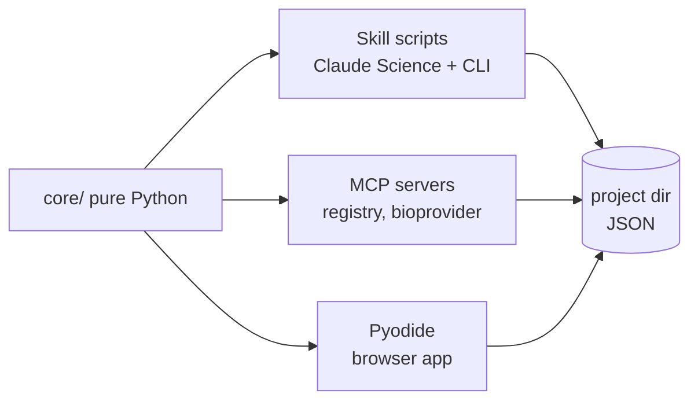
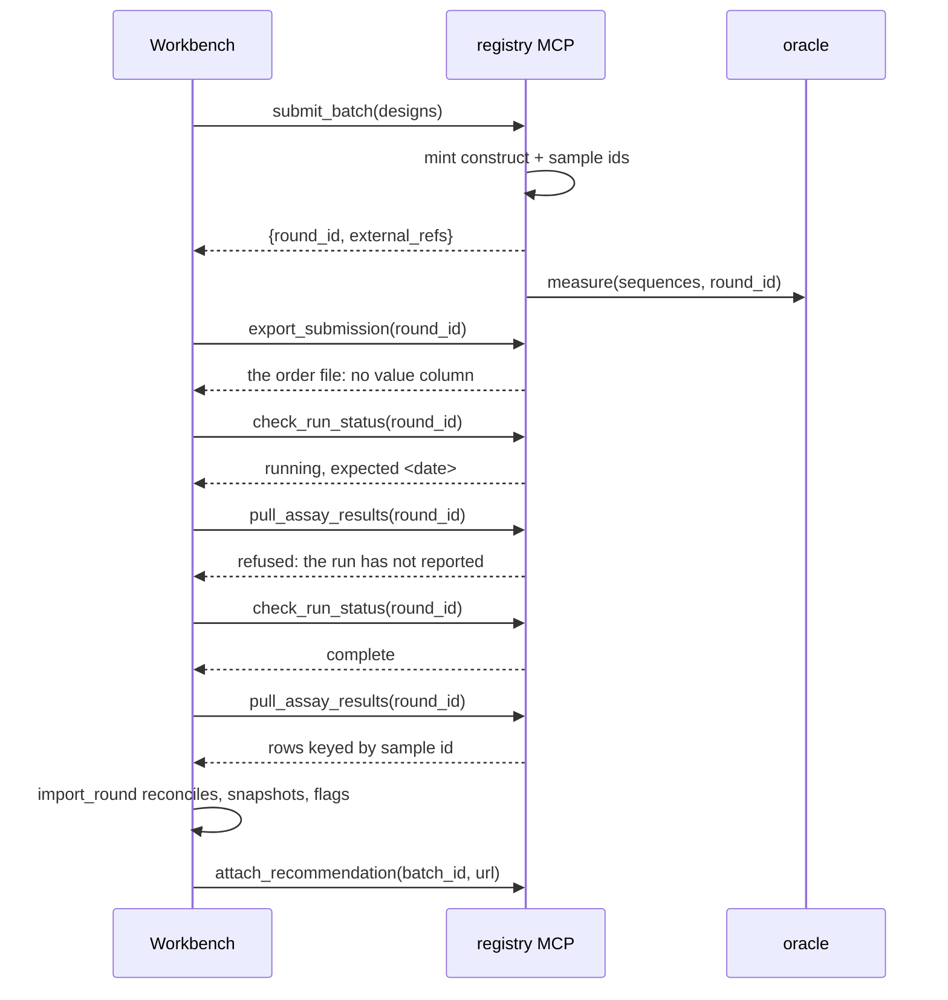

# Adaptive Optimization Workbench — One-Day Prototype Spec

## Purpose and thesis

The prototype exists to show Anthropic one thing: Claude Science is a workbench for analyses, and the missing layer above it is **persistent decision state across experimental rounds** — and the reason that layer matters is that it is what lets a model exercise judgment across rounds rather than answer one question at a time.

That layer is thin. It is a template that instantiates a project, a handful of skills that read and write that project's state, connectors that keep the LIMS authoritative, and a narrow surface for approving decisions instead of chatting about them.

**The proof artifact** is a single chart: cumulative best-observed binding affinity versus experimental round, model-guided selection against a random-selection baseline. Everything else makes that chart trustworthy and its decisions inspectable.

| Claim | Demonstrated by |
| --- | --- |
| The decision layer is thin and file-based, not another platform | Whole project state is a directory of JSON; the LIMS mock stays authoritative for samples and assays |
| The skills are real and portable, not demo mocks | The same `.py` files run in Claude Science, from the CLI, and in the deployed browser app |
| Typed artifacts and enumerated actions beat free-form output | The conversation stays; what it produces is a typed batch, a typed decision record, and four ruling verbs bound to code paths |
| The agent reasons rather than sequences | Round 4 comes back ambiguous; the agent forms competing hypotheses, tests them, and asks a named human to rule |

Visibly absent, because the concept doc lists them as non-goals: sample management, plate design, hosted GPU, de novo generation, autonomous approval.

## The one-day architecture

Five decisions make this a one-day build. They are load-bearing — deviating from any of them adds hours.

**1. One core, three surfaces, zero servers.** The optimization logic lives in `core/` as plain Python. The skill scripts, the MCP servers, and the web app all call it. Nothing is implemented twice.



**2. The browser runs the real Python, via Pyodide.** This is the key move. The deployed site loads the identical `core/*.py` files through Pyodide and runs the actual surrogate fit, batch selection, and diagnostics client-side. The site is fully static, works with no backend, no API key, and no cold start — and the pitch line "the same code runs in Claude Science and in this page" is literally true.

**3. Pure numpy, no scipy or scikit-learn.** An exact Gaussian process with an RBF kernel is about forty lines of numpy. Ridge regression is six. Each diagnostic is under twenty. Avoiding the heavy wheels keeps Pyodide's first load near three seconds instead of thirty, and keeps the skill's dependency footprint trivial for Claude Science.

**4. Everything expensive is precomputed at build time.** The candidate space is finite and enumerable, so the full feature matrix and the oracle ship as static assets.

**5. Everything laboratory is simulated, and nothing in the build waits on a download.** The landscape is synthetic, the features are one-hot, the provider backend is local. No dataset licence to resolve, no 150 MB model to fetch, no parse step that can fail at hour six. Real data and real embeddings are upgrades attempted only once a working demo exists end to end — see "After the demo works".

Cut from the earlier plan: the local FastAPI service (Pyodide replaces it), the four-view UI (one page, three panels), the second working template (shipped as a visible stub), structure prediction (a stub tool that returns a cached result), the real-data swap and the ESM-2 feature build (both moved off the day entirely).

## Repo layout

One core module tree, three surfaces over it.

| Path | Contents |
| --- | --- |
| core/ | Pure numpy, shared by every surface: encode.py, surrogate.py, candidates.py, acquisition.py, scoring.py, diagnostics.py, schema.py |
| skills/adaptive-optimization/ | SKILL.md plus seven thin CLI wrappers in scripts/ |
| connectors/ | registry\_server.py (LIMS stand-in), bioprovider\_server.py (Tamarind-shaped provider). Not `mcp/`, which shadows the SDK — decision 90 |
| templates/ | antibody-affinity-maturation/, plus a stub second template |
| data/ | build\_oracle.py, build\_features.py, synthetic.py |
| web/ | Vite app: the Claude Science-shaped shell, its artifact tabs, and public/assets/ for the precomputed matrices |
| netlify/functions/ | ask.ts — the single stateless model proxy |
| projects/demo-trastuzumab/ | A completed six-round project, committed to the repo |
| simulate\_campaign.py | Headless N-round run that emits the proof chart |
| DECISIONS.md | Every choice the spec left open, plus the pre-registered landscape parameters |

The web build step copies `core/*.py` into `web/public/core/` so Pyodide fetches the same files the skill executes. Claude Code must not port them to JavaScript — that fork is the one mistake that would undermine the whole demo.

## Data layer

The oracle answers exactly one question: given these sequences, what would the lab have reported? It sits behind an adapter, and in this build the adapter has exactly one implementation.

```python
# data/oracle.py
def measure(sequences, round_id):
    """-> [{sequence, affinity, replicate, censored, failed}]
    Injects lognormal assay noise, ~3% construct failure,
    left-censoring at the detection limit, and a per-round batch offset."""
```

The noise model is not decoration. It is what gives the import step real reconciliation work, what makes the calibration panel non-trivial, and what makes round 4 genuinely ambiguous. The per-round offset applies to every well in the round, controls included, which is what makes it recoverable from the controls rather than merely a nuisance.

**Units, fixed once.** The objective is pKD, the negative base-ten logarithm of the dissociation constant, so higher is better and the detection limit censors weak binders from below. Every value crossing a file boundary carries `unit: "pKD"`. A sign error here points the entire proof chart downward, so the loader asserts the convention instead of trusting it.

**The landscape is synthetic and its parameters are pre-registered.** `data/synthetic.py` generates an NK-style landscape over eight positions with tunable epistasis, plus a deliberate structure-activity cliff at one high-value position. Owning the landscape means owning a temptation: if the hour-3 gate fails, the quickest fix is a parameter rather than the science. That fix is forbidden.

Every landscape parameter — epistasis order, ruggedness, noise scale, cliff position and depth, detection limit — is written into `DECISIONS.md` and committed **before** `simulate_campaign.py` runs for the first time, justified on grounds independent of the result. Git history then proves the order. If guided does not separate from random on that landscape, the spec's answer is to say so, not to regenerate the landscape.

**What a synthetic chart proves.** It proves the loop is wired correctly, the surrogate learns, the acquisition prefers better designs, and the decision layer carries state between rounds. It does not prove this method finds better antibodies. Both the README and the demo say the first sentence and not the second. The line to use out loud: *this is a synthetic landscape, so the chart proves the machinery, not the chemistry — point it at real data and the same code runs.*

**Objectives.** Affinity is the measured objective. The secondary objectives are deterministic in-silico scores computed by `core/scoring.py` on the same sequences: hydrophobicity, net charge, and liability motifs (NG deamidation, DG isomerization, unpaired cysteine).

The asymmetry is an asset, and it decides what each kind of objective is for. Affinity is uncertain, so it is optimized under a model. The computed scores are exact, so their thresholds are enforced as filters before optimization runs and whatever margin remains is a tie-break among candidates that already pass. The batch panel renders the difference visibly — wide uncertainty bars on affinity, none at all on the computed scores. Treating all three as objectives and multiplying a probability of satisfaction into the acquisition would be theatre, because that probability is always zero or one.

## The comparison

The chart is the claim, so the protocol behind it belongs in the spec rather than inside the script.

Two arms run over the same landscape, from the same round-1 seed batch, drawing from the same post-constraint candidate pool. Sharing the seed removes the luck of the first draw. Sharing the pool means the chart measures the model rather than the liability filter, which is a separate and much smaller claim.

| Element | Choice |
| --- | --- |
| Arms | Guided, and random from the feasible pool |
| Seeds | 20 independent runs per arm, plotted as median with an interquartile band |
| Round 1 | A diversity-maximizing seed batch, identical across arms and seeds |
| Budget | Identical per round, with controls and replicates counted against both arms |
| Threshold | The 99th percentile of the landscape, fixed before the first run |
| Headline metric | Cumulative best observed pKD, which is what the lab would report |
| Diagnostic metric | Cumulative best landscape pKD over the designs each arm chose |

One guided curve against one random curve is an anecdote, and this audience counts runs. Twenty seeds of six rounds is under a minute of numpy. Fixing the threshold before the first run is what separates a result from a number chosen after seeing the curve.

**Why two metrics.** Best-observed is the honest lab view and stays the headline. It is also a maximum over noisy reads, so a random arm can be flattered by one lucky well. The diagnostic line scores the same selections at the landscape value, before the simulated assay noise is added. On a synthetic landscape both lines are invented and the diagnostic is labelled as such.

Compute both in hour two. If they track each other, ship the single chart and the question never arises. If they diverge, the assay noise is large enough to convince a lab it has found a winner — a real result, one the calibration panel should carry, and far better found in hour two than on stage.

**A third arm, if it earns its place.** Guided selection with naive pooling — no offset correction at round 4 — should degrade measurably against corrected guided selection. If it does, the diagnosis step has a number attached rather than a story, and the chart carries three lines. If mis-correcting turns out not to hurt measurably, say so and drop the arm. Same discipline as the threshold: the arm is not kept because it looks good.

## Feature layer

One-hot is the only feature block in this build. Eight positions by twenty amino acids, written once at build time to `web/public/assets/features_onehot.bin` as float32.

This costs less than it sounds. Over eight positions with at most two mutations, a one-hot ridge model is expected to beat PCA-reduced embeddings anyway — the FLAb2 benchmark found that with enough data a fine-tuned one-hot encoding model can match fine-tuned billion-parameter pretrained models. A product that picks the simple model when the simple model wins is more credible to this audience, not less.

**The bake-off survives intact.** `gp_pca64` is defined as a Gaussian process over the first 64 principal components of *whichever feature block is active*. With one-hot as the active block, that is a PCA over the 160-dimensional one-hot matrix — a real reduction and a real second recipe. So the model registry still fits two genuine recipes each round, cross-validates, selects on held-out calibrated performance, and reports which won. Every model run records the block it used and the interface prints it.

`web/public/assets/oracle.bin` ships alongside, holding landscape values, loaded only by the simulated lab.

## The skill pack

One skill, seven scripts. Every script takes a project directory and writes back into it. No script talks to the network. This is what makes the skill droppable into Claude Science and runnable under Pyodide without modification.

`SKILL.md` frontmatter carries `name: adaptive-optimization` and a description that fires on antibody or protein lead optimization, design-test-learn rounds, and batch selection. The body is short: the project state contract, when to call each script in sequence, the diagnosis procedure, and four rules the agent must not break — never change objectives without explicit approval, never pool measurements across assay versions without a bridging set, never invent a model recipe outside the registry, and never write a number into a decision record that did not come from a named `core/` function.

| Script | Reads | Writes | Does |
| --- | --- | --- | --- |
| import\_round.py | a results CSV | evidence/snapshot\_NNN.json | Reconciles returned measurements to designs, checks units, bridges assay versions through the shared controls, keeps censored wells as censored, averages replicates, hashes the result into an immutable manifest, and sets the anomaly flag |
| fit\_surrogates.py | all snapshots | models/run\_NNN.json | Fits every registered recipe, cross-validates, computes calibration (coverage of the 80% interval), picks the winner, stores predictions for the whole candidate pool |
| generate\_candidates.py | objectives.json | candidates/pool\_NNN.json | Enumerates variants inside the editable region under the mutation budget, applies hard constraints and liability filters, reports how many were removed and why |
| select\_batch.py | pool + model run | batches/batch\_NNN.json | Constrained selection with an explicit diversity term, plus controls and replicates, with per-design rationale and an extrapolation flag |
| evaluate\_prior.py | batch N-1 + snapshot N | batches/batch\_NNN.eval.json | Compares predictions for the designs actually approved against what came back, reports calibration drift and realized improvement against the random baseline |
| run\_diagnostic.py | snapshot + model run | stdout JSON | Runs one named test from `core/diagnostics.py` and returns its result. Read-only; writes nothing |
| record\_decision.py | a decision payload | decisions/decision\_NNN.json | Writes hypotheses, evidence, recommendation and ruling into the project, hashing its inputs. A dumb writer with no logic of its own |

**Model registry.** Two recipes only. `ridge_onehot` is ridge regression on one-hot features, read as Bayesian linear regression so the predictive variance is analytic. `gp_pca64` is an exact Gaussian process with an RBF kernel on the first 64 principal components of the active feature block, fit by grid search over two hyperparameters against the marginal likelihood. Both are under fifty lines of numpy. Only affinity is measured, so there is exactly one surrogate per round and the bake-off is between recipes rather than across objectives.

Censored wells enter the fit at the detection limit, carrying a flag. That biases them slightly upward and is the boring choice; the alternative is a Tobit likelihood and it is not worth the hour. Record the choice and surface the flag in the batch table.

**Acquisition.** The hard thresholds are already gone by this point: `generate_candidates` removed every candidate that failed one and reported the count and the reason. What survives is scored by expected improvement on affinity, then selected greedily with a diversity penalty on sequence distance to members already chosen, breaking ties toward the better developability margin.

Every batch carries the same controls: the parent, two designs from the previous batch as replicates, and two deliberately high-uncertainty designs. The first three exist so that round-to-round offsets are estimable rather than merely suffered — they are also the bridging set the diagnosis step depends on. The last two are the visible difference between exploitation and information gathering, and the UI labels them.

Batch size is inclusive. A batch of 48 is 42 fresh picks plus the six control, replicate, and exploration slots, so the number of wells is the number the scientist set. The random arm spends the same budget the same way.

**Round 1 needs no extra script.** With no model run on disk, `select_batch` has nothing to exploit, so it returns a diversity-maximizing seed batch over the feasible pool and says so in the rationale. That is the same code path, one branch deep, and it is the batch both arms of the comparison start from.

## Diagnosis and decision records

Everything above is a pipeline: import, fit, generate, select, repeat. A pipeline runs the same steps whatever comes back, and a scheduler can drive it. The part that needs an agent is the part where the next action depends on what was observed and more than one action is defensible.

There is exactly one such moment in this prototype. Build it properly rather than building five of them badly.

**The trigger is code.** `import_round` compares each returned measurement against the previous model run's 80% predictive interval and writes `flagged: true` on the snapshot when the fraction falling outside exceeds 0.35 against an expected 0.20. That is a threshold in the template, not a judgment.

**The diagnosis is not.** A round where most designs come back low has several explanations that are indistinguishable in the marginals:

| Hypothesis | If true, the right action is |
| --- | --- |
| Assay-version or reagent offset | Estimate the offset from the shared controls, correct, then pool |
| Plate or well-position artifact | Correct per group, or drop the affected wells |
| The model extrapolated into a region it has not seen | Nothing to the data. Refit and widen exploration next round |
| A real structure-activity cliff the optimizer walked into | Nothing to the data. Correcting it away would erase the finding |

Rows one and four produce the same first look and opposite actions. Telling them apart means knowing to condition on the designs shared with earlier rounds rather than on the new ones, checking whether those shared designs agree with each other at all, and refusing to correct when they do not. And the second test worth running depends on what the first returned. That sequence is the agent's contribution, and it differs by round.

**The diagnostics are code.** Five functions in `core/diagnostics.py`, pure numpy, read-only, each under twenty lines:

| Test | Returns |
| --- | --- |
| offset\_from\_controls | Additive per-round offset estimated from designs shared with earlier rounds, its standard error, the bridge size, and whether the bridge members agree with each other |
| residual\_by\_plate | Mean prediction residual grouped by plate, with spread, and the largest gap between plates against its standard error |
| residual\_by\_mutation\_class | Mean residual grouped by which position was mutated, and each class against the rest |
| replicate\_concordance | Spread between replicate rows for the same sample, flagging designs whose replicates disagree beyond assay noise |
| calibration\_by\_region | Coverage of the 80% interval overall and within predicted-value bins, and the coverage a correction of a named size would leave |

**The corrections are code too.** The agent never transforms data. It names an action — `apply_offset_correction`, `drop_wells`, `refit_only`, `no_action` — and a `core/` function performs it once a human has ruled.

**Ad hoc analysis is the escape hatch.** Five diagnostics is a fixed set, and the sixth question is always the interesting one. When the scientist or the agent needs something the library does not cover — *do the designs carrying N100D specifically underperform their predictions?* — the agent writes ten lines of numpy, executes it in the sandbox, and shows the code beside the number.

This is the only place model-written code is permitted, and the boundary is enforced by what is mounted rather than by instruction: the sandbox holds the snapshot arrays and `core/`, and never the oracle. Ad hoc results are evidence a human reads. They are recorded in the decision record with their source inlined and labelled one-off and unversioned, and they are never an input to a code path. An ad hoc analysis that keeps getting run is a candidate addition to `core/diagnostics.py` — the agent's one-off becoming methodology is the template thesis one level down.

**The decision record is the artifact.** One JSON file per flagged round in `decisions/`, hashed and linked from `rounds.json` like everything else:

```json
{
  "id": "decision_004",
  "round": 4,
  "trigger": "38 of 42 designs below the predicted 80% interval",
  "hypotheses": [
    { "id": "h1", "claim": "Assay-version offset between v1.2 and v1.3",
      "diagnostic": "offset_from_controls",
      "result": { "offset_pkd": -0.81, "se": 0.09, "n_bridge": 3, "concordant": true },
      "reading": "supported" },
    { "id": "h2", "claim": "Position 102 substitutions destroy binding",
      "diagnostic": "residual_by_mutation_class",
      "result": { "class": "102X", "n": 11, "mean_residual": -0.22, "vs_other_classes": 0.04 },
      "reading": "not supported" }
  ],
  "ad_hoc": [
    { "question": "Is the offset consistent across both plates?",
      "code": "...", "stdout": "plate A -0.79, plate B -0.84, diff within se",
      "note": "one-off, unversioned" }
  ],
  "recommendation": {
    "action": "apply_offset_correction",
    "confidence": "high",
    "rationale": "...",
    "alternative_considered": "h2, rejected because the 102X residual is flat relative to other classes",
    "if_wrong": "Correcting a genuine cliff would hide it. The 102X class residual would not be flat if the cliff were real."
  },
  "ruling": { "verdict": "accepted", "by": "d.webster", "at": "...", "note": "" },
  "inputs": { "snapshot": "sha256:...", "model_run": "sha256:...", "batch": "sha256:..." }
}
```

`if_wrong` is not decoration. An agent that states what would falsify its own recommendation is inspectable in a way that a confident paragraph is not, and it is the field a sceptical scientist reads first.

**Oversight has four verbs, not two.** `accepted`, `accepted_with_modification`, `rejected` with a reason, and `more_evidence_requested`, which names a test and sends the agent back to run it. That last one is the loop closing: the human pushes work back to the agent without dropping into open chat. Every ruling carries a named approver and a timestamp, and no action is taken on an unruled record.

`more_evidence_requested` is the verb a pipeline cannot imitate, so it is exercised rather than merely defined. The demo project's round-4 record is two-pass: a recommendation, a ruling that names a test the agent had not run, the test, a revised recommendation, and the final ruling. Both passes are committed, so the beat survives with no key. It is acceptance criterion 8.

**Refusal is a valid recommendation.** If the bridging set is missing or its members disagree, the correct output is `no_action` with `confidence: "refuses"` and an explanation. Having a principled reason not to refuse is the better demo; being unable to refuse is the worse product.

**Round 4 in the demo project.** The oracle already applies a per-round offset and the assay version already changes at round 4, and an exploiting optimizer naturally concentrates on one mutation class — so check whether the ambiguity arises on its own before engineering it. If it does not, place the synthetic landscape's cliff at a high-expected-improvement position, record that parameter in `DECISIONS.md` with the rest, and let the campaign walk into it.

Phase 3 confirmed it arises on its own, and richer than this sketched. The bridge recovers about a pKD of assay shift against a fresh-design discrepancy of two, the residual is flat across mutated positions so the cliff is ruled out, and what remains is the model extrapolating from an incumbent inflated by taking a maximum over noisy reads. A diagnosis that corrects the offset and stops is wrong about half the round, which is a better artifact than the single-cause story. `DECISIONS.md` has the numbers.

## Project state

A project is a directory. That is the whole persistence layer — no database, no server, and it means the skill, the MCP servers, and the browser are reading the same bytes.

```text
projects/demo-trastuzumab/
  project.json          lead, target, team, connected sources, template id
  objectives.json       properties, thresholds, batch size, mutation rules, editable region
  designs.json          sequence, hash, parent, mutation list, registry id
  evidence/snapshot_001.json ...
  models/run_001.json ...
  candidates/pool_001.json ...
  batches/batch_001.json, batch_001.eval.json ...
  decisions/decision_004.json ...
  rounds.json           the decision graph: which batch led to which snapshot led to which model
```

`rounds.json` is the artifact that matters. It is the thin longitudinal link from recommendation to tested constructs to returned evidence to diagnosis to updated model to next batch, and it is what the history panel renders. Everything else could be regenerated; this cannot.

**A batch record separates what was proposed from what was run.** `recommended` is what the optimizer returned, `approved` is what the scientist let through, and `overrides` records each removal with a note, an approver, and a timestamp. Usually the two lists are identical, and the demo project makes them differ on purpose. This is the governance claim in one file: the system proposes, a named person disposes, and the evaluation step scores predictions for what was actually tested.

Every snapshot, model run, batch, and decision carries a content hash and the hashes of its inputs. Reproducibility in the demo is not a claim in a slide — click any batch and the UI walks back to the exact evidence that produced it.

Hashes are taken over canonical JSON: sorted keys, no insignificant whitespace, floats at fixed precision. Without that rule two surfaces produce two hashes for one decision and the lineage claim quietly stops being checkable. Fixed precision is also what keeps the hash stable across numpy under WebAssembly and numpy on a laptop, which will not agree in the last bits.

The concept doc names eight durable entities. Seven are implemented as files; one is deliberately reduced.

| Concept entity | Prototype | Reduced? |
| --- | --- | --- |
| Optimization project | project.json | No |
| Design | designs.json rows with sequence hash, parent, mutation list | No |
| External reference | the link table inside designs.json | No |
| Evidence snapshot | evidence/snapshot\_NNN.json, content-hashed | No |
| Objective specification | objectives.json, versioned on edit | No |
| Model run | models/run\_NNN.json | Fitted model artifact stored as coefficients, not a pickle |
| Recommendation batch | batches/batch\_NNN.json with rationale and overrides | No |
| Experimental round | rounds.json | No |

Decision records are an addition rather than a reduction: the concept doc has no entity for "a judgment call made between rounds", and it turns out to be the one that carries the agentic claim.

Feature and embedding lineage from the concept doc is recorded as a build hash on the feature assets rather than a full lineage graph. Say so if asked; it is the one place the prototype is thinner than the concept.

## Mock MCP servers

Two stdio servers built with FastMCP, about eighty lines each, both thin wrappers over `core/` and the project directory. They exist to make two boundary claims demonstrable rather than asserted.

**`registry_server.py` — the LIMS stand-in.** Tools: `submit_batch`, `list_designs`, `pull_assay_results(round_id)`, `get_construct(id)`, and `attach_recommendation(batch_id, report_url)`. The write path is deliberately crippled: it can attach a recommendation ID and a link to an existing record, and it cannot create samples, edit assay data, or drive a workflow. When someone asks in the demo whether this replaces Benchling, the answer is a tool list.

**`bioprovider_server.py` — the Tamarind-shaped provider.** Tools: `embed_sequences(model, sequences)`, `score_properties(tool_set, candidates)`, `predict_structures(model, complexes)`. The interface is real and the backend is a config field in `project.json`. Only the `local` backend is built: `embed_sequences` returns the precomputed one-hot matrix, `predict_structures` returns a cached result with an honest note that structure prediction is stubbed. An `esm_live` backend is declared and unwired, and selecting it returns a clear "not available in this build" error rather than a silent fallback. Both facts go in the staged table.

Register both in `.mcp.json` at the repo root so the demo starts with one command.

## The round handoff

The simulated lab lives behind the registry server, not inside the workbench. `core/` must never import the oracle. This is what keeps the boundary claim honest: the workbench sees only what a lab reported, never ground truth.



`submit_batch` mints construct and sample identifiers in its own namespace, records the round as in flight, and returns only the external references — the workbench stores those links in `designs.json` and owns nothing about the samples themselves.

`pull_assay_results` returns rows shaped the way a real export is shaped, not the way the model wants them:

| Field | Note |
| --- | --- |
| sample\_id | The registry's identifier. Never the design id — reconciliation is the point |
| plate, well | Present so batch effects have somewhere to live, and so `residual_by_plate` has something to group on |
| assay\_version | Changes at round 4 in the demo project, which forces the bridging path to fire visibly |
| value, unit | Raw assay units, not normalized |
| status | ok, failed, or censored\_low |
| replicate | Separate rows, not pre-averaged |

About 3% of rows come back failed and a few land below the detection limit. `import_round` joins on the external reference table, averages replicates, keeps censored values as censored rather than dropping them, and only then writes the snapshot.

**Version changes are bridged, not ignored.** The naive rule — never pool across assay versions — is correct, and it would also discard rounds 1 through 3 at exactly the moment the calibration panel is on screen. The batch composition already solves this. Every batch carries the parent and two replicates from the round before it, so consecutive rounds share designs and a per-round offset is estimable from them. `import_round` does not decide what to do about it: it reports the bridge and flags the round, and the diagnosis step decides whether the offset is an assay artifact or a real effect. If the bridging set is missing or its members disagree, the recommendation is to refuse to pool, and to say why.

In the browser the same contract holds: the web app calls a Python shim with the identical signature instead of the MCP server. One code path, two transports.

## Template library

A template is a packaged optimization workflow: the unit that turns a general-purpose agent into a product surface. It is the answer to "why isn't this just a good prompt?"

A prompt describes a task once. A template declares, ahead of any conversation, what the objectives schema looks like, which constraints are enforced, which model recipes are permitted, how batches are composed, which diagnostics may be run, and which panels the interface renders. The scientist then supplies three facts about their lead. Everything downstream follows from the template rather than from how well someone phrased a request.

That is also what makes runs comparable. Two teams using the same template produce decision records with the same shape, so the calibration and improvement numbers mean the same thing across projects. An open-ended chat cannot give you that.

Templates are authored by whoever owns methodology for a group — a computational lead, or a vendor shipping a validated workflow. Scientists consume them. This is the same split as a validated assay protocol, and it is the reason the template library is a library rather than a settings page.

```json
{
  "id": "antibody-affinity-maturation",
  "lead": { "name": "trastuzumab", "chain": "VH", "editable_region": [98, 106] },
  "objectives": [
    { "name": "affinity", "direction": "maximize", "unit": "pKD", "source": "measured" },
    { "name": "hydrophobicity", "direction": "minimize", "threshold": 0.45, "source": "computed" },
    { "name": "liability_count", "direction": "minimize", "threshold": 0, "source": "computed" }
  ],
  "constraints": { "max_mutations": 2, "forbidden_motifs": ["NG", "DG", "C"] },
  "batch": { "size": 48, "controls": 2, "replicates": 2, "exploration_slots": 2 },
  "model_recipes": ["ridge_onehot", "gp_pca64"],
  "diagnostics": ["offset_from_controls", "residual_by_plate", "residual_by_mutation_class",
                  "replicate_concordance", "calibration_by_region"],
  "anomaly_flag": { "interval": 0.8, "expected_outside": 0.2, "trigger_above": 0.35 },
  "panels": ["setup", "batch_review", "progress"]
}
```

| The template fixes | The scientist supplies |
| --- | --- |
| Objective schema and which properties are measured vs computed | The lead sequence and target name |
| The constraint ruleset and forbidden motifs | The editable region and mutation budget |
| The allowed model recipes | Nothing — recipe selection is automatic and reported |
| The permitted diagnostics and the anomaly threshold | Nothing |
| Batch composition policy: controls, replicates and exploration slots, all counted inside the batch size | Batch size, within limits the template sets |
| Which panels render and in what order | Nothing |

**Lifecycle.** Browse the library, pick a template, fill three fields, and a project directory exists with `project.json`, `objectives.json`, and an empty round history. From that moment the skill scripts, the MCP servers, and the web panels all read the same declarations. `project.json` records the template id and version, so a project keeps working when the template later changes.

**What a template is not.** It is not a prompt, not a saved chat, and not a config file for the model. Nothing in it is advisory — the constraint ruleset is enforced by `core/candidates.py` before optimization runs, a recipe absent from the template's list cannot be fitted even if the agent asks for it, and the anomaly threshold is evaluated in code.

In the prototype, ship one working template and one stub. The stub exists in the picker, greyed out, purely so the audience sees that the abstraction is not single-purpose.

## Web app

Vite plus React, static output, deployed to a default Netlify URL. A hash router, no state library, no backend beyond a single stateless function.

> **Amended by the redesign — decisions 122 to 133.** Where this section and the four bullets below it disagree, the bullets govern; the rest of the section is accurate and is what they were built on top of.
>
> - **Two shells, not one.** Home is full-bleed and centred with no rail and no artifact panel; a project gets the three regions, scoped to one project. The rail header is the *project*. Routes: `#/`, `#/new`, `#/templates`, `#/p/<id>`, `#/p/<id>/s/new`, `#/p/<id>/s/<session>`, `#/p/<id>/rounds`.
> - **A session is a unit of work, not a round.** A round starts one; a person can start an ad-hoc one at any time; both kinds share the rail list and home's Recent sessions. Opening a project lands on what it needs from you — a pending ruling, a pending approval, a round at the lab — and the round graph is a view one click away rather than a lobby.
> - **Decisions are buttons; questions are asks.** Approval and the four ruling verbs stay outside the composer. Reads — status, why a round flagged, whether the lab has reported — are contextual suggested asks under it, answered until phase 7 by a deterministic briefing assembled in `wb_driver` from artifacts on disk, every figure naming its `core/` function.
> - **Projects are created here, both kinds.** From a template, through a mostly locked configuration screen read out of `template.json`, running `init_project.py` and round 1's two scripts in Pyodide. Or blank, which never touches Python and opens on an empty chat — the control arm for decision 108.

**The layout is Claude Science's, because the claim is that this is a layer inside it rather than a product beside it — and phase 5b earns the right to say so by running inside it first.** A bespoke dashboard makes the audience translate; borrowing the host's own grammar makes the argument before anyone reads a word of copy. It is also less to build, not more — the three panels of the earlier plan become tabs in a slot that already exists. Three regions and a home screen, mirroring the beta:

| Claude Science | Here | What the borrowed slot carries |
| --- | --- | --- |
| Home, *1 waiting on you* | *Round 4 — ruling pending · 2 hypotheses*, with the `Needs you` badge | Their approval primitive is an untyped chat interrupt — *asking what the new specialist should do*. Ours is a typed decision with hashed evidence, an `if_wrong` line, and four verbs bound to code paths |
| Home, Projects and Recent sessions | Projects and recent rounds. `+ New project` opens the template gallery | Demo beat 1, in its native slot |
| Left rail: New, Search, Customize, Files, Compute | The same, plus one added item: **Rounds** | Exactly one new primitive, sitting where it would ship. Everything above it already exists in the product |
| Rail: Active and Older sessions | *Round 4 · diagnosis* active, *Round 3 · batch approved*, *Round 2 · flagged, refit* — each with its elapsed date | The longitudinal claim, visible at a glance. A session list spanning six weeks is the argument for persistent decision state |
| Centre: conversation, inline figures, generated-artifact chips, the composer | The round's session: the agent's messages, its tool-call stream, artifact chips, the same composer | The reasoning panel stops being a sidebar and becomes the centre column, which is where judgment belongs |
| Right: artifact viewer with a version stepper and a Notebook toggle | Tabs — Batch, Decision, Progress, Objectives, Notebook — with `< v2 >` where versions are real | Objectives is versioned on amendment and a snapshot is rewritten when a round is corrected, so the stepper is not decoration |

**The chrome is a wireframe, and this document says so.** The panels, the Python, the state and the hashes inside it are real; the frame around them is not the product. That distinction lives in the staged table below and in the README — decision 125 took the banner off the page, because a bar across every screen taxed every beat to make a claim once, and the table is where a sceptic goes looking. Individual mock fields still carry their own label where they sit, as a word or a tooltip. **The page shows and does not tell** (decision 134): nothing on it explains why it is shaped the way it is, and the *synthetic* claim is a one-word tag where a figure is quoted in prose, with this table and the README carrying the full statement (decision 136).

**It is a proposal, not an imitation, and 5b is what makes that true.** The order of the argument matters more than either piece of it. We install into the host, run a real campaign there, and hit the wall; the audit records where. Then every element of this shell exists because the audit named the thing it is standing in for — the `Needs you` card because a ruling is an untyped chat interrupt today, the Rounds item because `rounds.json` has nowhere to render, the Notebook tab because traceability is a reviewer's after-the-fact check rather than a structural guarantee. A mockup shown *before* that walk is a competitor's redesign of someone else's product. Shown after it, it is a feature request with a working implementation attached, which is the only version worth presenting.

**Objectives tab** — formerly the Setup panel. Renders `objectives.json`: editable region, mutation budget, per-objective direction and threshold, batch size. Read-only in this build, because editing objectives is the mechanic a stop-or-widen recommendation would need and that is not in scope for day one.

**Batch tab** — formerly Batch review. A table of the 48 selected designs with mutations, predicted value and interval per objective, selection rationale, and a badge for controls, replicates and exploration picks. Every row has a checkbox and an override note field. One Approve button. The Pareto scatter stays where it was, near the top of the cut list.

**Progress tab.** Two charts, both this project's own. Cumulative best observed pKD by round, read from the project's snapshots, with flagged rounds marked and a target line only if the template declares one. And calibration — predicted against observed for the previous batch, with the 80% interval coverage printed as a number. The proof chart — model-guided against the random baseline's median and interquartile band, plus the naive-pooling arm — is the evaluator's benchmark and is drawn as the template's **Validation**, on the Objectives tab and the New project configure card, never on a project's own axes (decision 135). A real campaign has no random arm to be compared against, and a benchmark overlaid on a live line reads as a forecast.

**The Notebook tab is where non-negotiable 7 becomes visible, and it is the cheapest credibility in the build.** Claude Science ships a background reviewer that flags *untraceable numbers*. Click any figure in the batch table or the decision record and the Notebook tab shows the `core/` function that produced it, its source, its arguments and its input hash. The line to use: *their reviewer catches untraceable numbers after the fact; a template makes them impossible to write.* It renders lineage the project already stores, so it costs a component and no new plumbing.

**The interactive loop, entirely in-browser — and with a laboratory in the middle of it.** Approving signs the batch, submits it to the registry and calls `export_submission` for the order file the lab receives, which the visitor can download. The round's status becomes **at the lab**, and that is all that happens. Whether the results are back is a separate question, put to the registry by a suggested ask under the composer: the first ask comes back not ready with the date it is expected, and `pull_assay_results` refuses and says what it refused. The second ask releases the run, and then the pull, `import_round` and `evaluate_prior` run as the continuation of that one answer — because the arrival is the first moment there is anything to say, and the reconciliation and the anomaly verdict belong in the same turn. Once ruled, the correction, `fit_surrogates`, `generate_candidates` and `select_batch` run through Pyodide and the app re-renders with round N+1 proposed. Two to four seconds of compute, split across two deliberate moments.

The staggering costs no invariant. `lims.py`'s round record already carried `status`, `submitted`, `samples` and `rows`; `submit_batch` gains a `stagger` argument, off by default, and off writes byte-for-byte what it has always written. A record with no `release_on_check` key is complete, so every existing store, every existing round and the six-round CLI campaign are untouched — decision 131.

On load: fetch the template list, load the committed demo project's state, boot Pyodide with numpy, fetch `core/*.py` into the Pyodide filesystem, fetch the binary assets into numpy arrays. Show a progress line while this happens — it takes a few seconds and pretending otherwise looks broken. Pin the Pyodide version and serve the runtime and the numpy wheel from the site's own origin. A demo that depends on a third-party CDN and conference wifi at the same moment has a coin flip in it.

Rounds a visitor runs live in the Pyodide filesystem and in `localStorage`, so a reload keeps their progress and Reset clears it. Nothing is written back to the repository, and the page says so. The oracle also ships in the bundle, because the simulated lab has to run client-side, so anyone can download ground truth. Say that first. The claim is that `core/` never reads it, and that is checkable by reading six files.

Ship the committed demo project at round three so a visitor lands mid-campaign with history already visible, and can run rounds four through six themselves — round four being the one that flags. A Reset link restores it.

## The agent in the session

> **Built in phase 7 — decisions 137 to 152.** Where this section and the amendments below disagree, the amendments govern.
>
> - **The system prompt is the skill.** `SKILL.md` verbatim, behind a preamble that maps its scripts onto tools, generated into the function by `web/bundle.py` and checked for byte identity. One file drives Claude Code, Claude Science and the browser.
> - **The context is client-supplied**, not loaded server-side: the state is the visitor's, in their tab (decision 119). `wb_driver.agent_context` reads it from artifacts, computes nothing, and the page sends it as the last, cached system block.
> - **The function accepts only transcripts it signed.** An HMAC over the message list closes the "free endpoint" hole the paragraph below names; a tool result must answer a call the model made; the model is one of three ids; the context and every string are capped.
> - **Three tools, not two.** `run_diagnostic` and `execute_analysis` read; `propose_decision` is `record_decision.py --propose`, and the writer's refusal comes back to the model as an error result. Nothing the model calls writes state.
> - **`max_tokens` is 16 000 on a diagnosis turn**, at effort `low` with adaptive thinking; the proposal turn carries the record and thinking counts against the cap.
> - **Both passes of round 4's record are committed; the final ruling is not.** The verdict is the visitor's to give, and the round stays deliberately unruled.

The centre column is where the agentic claim is made or lost, so nothing in it is decorative and it is built before the polish.

**What it is fixing.** Without this section the browser shows three things that are not an agent. Approve runs the same five steps whatever comes back, which is a scheduler with a mouse. The decision card renders a record produced yesterday, in a terminal, on a laptop. And a panel that answers questions but cannot write project state is a narrator with a calculator. The agentic claim would then rest entirely on the terminal beat, which to an audience looks like a different product.

**Orchestration runs live; the verdict stays the human's.** Those separate cleanly and only the first needs to be live. Under non-negotiable 7 the model produces no numbers, the tests come from the template's allowlist, and the action is one of four verbs a named person rules on — so a live model here chooses a sequence from a five-item list and writes prose. That is bounded, cheap and low-variance, and it is precisely the part a scheduler cannot do. The risk the earlier plan was avoiding is a wrong *verdict* on stage, and the four ruling buttons already absorb it: a wrong recommendation that a human visibly rejects is a better governance demo than a right one.

**One tool-call stream component, two sources.** The diagnosis arrives a step at a time — *chose `offset_from_controls`; −1.014 pKD, se 0.059, bridge concordant; therefore chose `residual_by_mutation_class`; flat, so the cliff is not supported; coverage 0.07 against 0.80, so the remainder is the model.* In **live** mode the model drives it. In **replay** mode the committed record drives the same component with the same animation, and every diagnostic is genuinely recomputed in Pyodide and checked against the record. One component, and the badge is the only visible difference. A visitor at 2am with no key watches reasoning happen rather than reading a finished JSON blob.

**The push-back is the loop closing.** `more_evidence_requested` is the one beat a pipeline cannot imitate, and the earlier plan defined it without ever firing it. Round 4's record is therefore two-pass: a recommendation, a ruling naming `calibration_by_region`, the test, a revised recommendation, the final ruling. Live mode does it for real; replay steps the recorded second pass. One extra recorded pass, no new code, and it is acceptance criterion 8.

**The agent speaks on quiet rounds too.** An unflagged round gets one line — *coverage 0.78, offset inside its standard error, nothing to decide, proceed.* Declining to act is judgment, and an agent that appears only when something breaks is an alarm rather than a colleague.

**Two tools, both read-only.** `run_diagnostic(test, round)` calls a named function from `core/diagnostics.py`. `execute_analysis(code)` runs model-written numpy in the Pyodide sandbox against the mounted snapshot arrays. Neither can write project state, and the model cannot name a test outside the template's list. Every write happens through a ruling.

**Context.** The session receives the whole decision state, not just the current batch: the decision record, the diagnostic outputs, `rounds.json`, `objectives.json`, the active model run, the previous batch's eval, and a summarized batch table rather than all 48 rows with full rationale. That lands near 20k tokens, cached as a stable prefix with the visitor's question placed after the breakpoint.

**The tool loop lives in the browser.** Pyodide is where the data and the sandbox already are, and the key cannot go client-side, so `netlify/functions/ask.ts` is a stateless single-turn proxy over `messages.create` and React owns the `while stop_reason == "tool_use"` loop. Each function invocation is one short model turn, which keeps every request inside Netlify's synchronous window. On the CLI path there is no function at all: Claude Code is the loop and Bash is the sandbox.

**The function is not a proxy for the Claude API.** It builds the request itself from a fixed system prompt, the project state it loads server-side, and the visitor's question as a length-capped string. It must never accept a client-supplied `messages` array — that would publish a free Opus endpoint under your key. This is the single most important line in this section.

**Model and cost.** `claude-sonnet-5` (decision 154; `claude-opus-5` until then) with `thinking: {type: "adaptive"}`, `output_config: {effort: "low"}`, streaming, and `max_tokens` around 400. Low effort is the cost lever that matters here; the session reads small JSON, picks tests and explains. With the prefix cached, a diagnosis costs on the order of a cent.

**`ask.ts` must handle `stop_reason: "refusal"`, and this is not hypothetical.** The phase 5 gate runs fired a safety-classifier refusal three times across two sessions, category `bio`, on antibody-engineering content — recoverable there because Claude Code retries, and both sessions completed. A single-shot proxy has no retry. A refusal returns **HTTP 200** with no usable content and `stop_details: {type: "refusal", category: ...}`, so code that reads `content[0].text` on a 200 renders an empty bubble on stage. Three requirements, in order:

1. Send the server-side fallback on every request — `betas: ["server-side-fallback-2026-07-01"]` with `fallbacks: "default"`, which routes by refusal category and needs no model list. A decline before any output is not billed; the rescue bills at the fallback model's rates. That alone would have absorbed all three of the gate's refusals.
2. Check `stop_reason` before reading `content`, on every response. `stop_details` is populated only for `refusal` and is `null` otherwise, so guard it. A `refusal` on the final response means the whole chain declined.
3. Treat that case exactly as the budget cap is treated: flip to verified replay and say so on the badge. The fallback already exists for the cap, and this is a second door into the same room rather than new machinery.

None of this is a reason to change models. It is a reason the browser path's default has to be replay and its live mode an upgrade, which is what the paragraph below already says — the refusal is simply one more way the upgrade can fail to apply.

**Anyone can use it, until the budget says otherwise.** The key lives in a Netlify environment variable, so visitors supply nothing. A global daily spend cap and a per-IP counter live in Netlify Blobs. Under the cap the session runs live. Over it, the site returns to replay — and the fallback is not a degraded mode, it is the default that live calls temporarily upgrade. The badge reads *live*, or *replayed · evidence recomputed · 5 of 5 values match*, and the page always says which mode it is in.

## Build order

Run these as separate Claude Code sessions with a clean context each. The gate at hour 3 is real: if the proof chart does not separate, stop and fix the science before building any interface.

There is a second gate at hour 5, and the simulated-only decision gives it teeth. It is no longer "the agent called five scripts in order" — it is whether the agent diagnosed an ambiguous round correctly from the skill and the connectors alone.

**Why the hour-5 gate is verified in Claude Code and demonstrated in Claude Science.** What the gate tests is whether `SKILL.md`, the five diagnostics and the state contract are *sufficient* — a property of the skill pack, not of the client. Claude Code is the harness that can be scripted, re-run after a skill edit, and committed as a transcript, so it holds the repeatable evidence and criterion 3 stays anchored there. Claude Science holds the demonstration, and beta access is confirmed: it accepts custom MCP connectors and local skill packs, so the same plugin installs and the same gate runs inside the host product. The repo carries the proof; the host carries the pitch.

**Phase 5b is not a screenshot errand.** Running inside the host is also the only way to find out whether the gap this whole artifact claims exists actually does. Claude Science already has projects, a Files directory, persistent kernels, artifacts that ship with their history, skills that every future session inherits, and a *waiting on you* queue. A sceptic will ask which of those already covers us, and the answer has to come from using it rather than from reading its marketing page. So 5b's deliverable is two things: the skill running in the host, and a written audit in `DECISIONS.md` of precisely where the host's abstractions run out. Phase 6 builds against that list. Any claimed gap that does not survive contact with the product is struck — same discipline as the threshold, applied to the pitch instead of the science.

| Phase | Deliverable | Done when |
| --- | --- | --- |
| 1 | Repo skeleton, synthetic oracle, project schema, one-hot encoder, landscape parameters committed to DECISIONS.md | A project directory can be created from the template and round 1 designs written |
| 2 | core/ surrogate, candidates, acquisition, plus simulate\_campaign.py | GATE: twenty seeds per arm, guided reaches the pre-registered threshold in fewer rounds, and the interquartile bands separate |
| 3 | The five pipeline scripts and SKILL.md wrapping core/ | The same six rounds run through the CLI scripts, not just the library |
| 4 | core/diagnostics.py, run\_diagnostic.py, record\_decision.py, the decision record schema | Each of the five tests returns a sane number on the round-4 snapshot |
| 5 | Both MCP servers, .mcp.json, one end-to-end run driven by an agent | GATE: an agent given only the skill and the connectors diagnoses round 4 correctly and writes a decision record. Verified in Claude Code, for the reason above |
| 5b | The plugin installed into Claude Science, the same gate re-run there, and the gap audit written | The skill and both connectors load in the host, the agent diagnoses round 4 there, and `DECISIONS.md` records which claimed gaps survived contact with the product and which were struck |
| 6 | Web app: Pyodide boot, the shell, the artifact tabs, the approve loop | Approving a batch advances the round in-browser in under five seconds, and round 4 opens its session instead of advancing |
| 7 | The agent in the session: the tool-call stream, the tools, the push-back round trip, budget cap, verified replay | Runs the diagnosis live with a key and steps the recorded one without, through the same component. **Done — decisions 137 to 152**; the loop round-trips in `check.py` through a scripted upstream, and the replay's badge is a count the driver made |
| 8 | Committed demo project at round 3, Netlify deploy, README with the staged table | The public URL runs a round and a ruling from a cold visit with no key |
| 9 | Demo script, five-minute rehearsal, cut anything broken | You can run it start to finish without apologising |

## After the demo works

Attempt none of this until phase 9 passes. Each is a self-contained upgrade that changes one file and leaves the rest of the system alone.

| Upgrade | Change | Why it is not on the day |
| --- | --- | --- |
| Real measured affinities | Swap the oracle adapter for a loader over [Absci trast-1](https://www.biorxiv.org/content/10.1101/2022.08.16.504181v1.full) (8,932 variants, two mutations across eight CDR-H3 positions) or the [AbCDR-Binding](https://zenodo.org/records/18762978) sets | A licence question or a parse failure at hour six sinks the build, and it upgrades the chart's claim rather than the system |
| Real embeddings | `data/build_features.py` loads ESM-2 `esm2_t12_35M_UR50D`, mean-pools, fits a 64-component PCA, writes a second feature block | A 150 MB download and an inference pass for a recipe the one-hot model is expected to beat anyway |
| Live provider backend | Wire `esm_live` in bioprovider\_server.py | Cannot run in the browser, so it proves the interface claim on the CLI only |
| Stop / widen / confirm recommendations | A sixth decision type, plus making the Setup panel editable again | The mechanic is objectives amendment, which pulls in versioning and staleness across the UI |
| Cross-round constraint learning | A query over all snapshots proposing a constraint amendment | Same dependency, and it is the strongest of the three — build it first if the list gets picked up |

If the real data lands, one line changes in the README and one sentence changes on stage. That is the point of keeping the oracle behind an adapter.

## Acceptance and demo script

**Acceptance criteria.** Eight in total, and all eight are testable.

1. `simulate_campaign.py` produces a chart where guided selection reaches the pre-registered threshold in measurably fewer rounds than random, over twenty seeds per arm.
2. Claude Code, given only the skill and the two MCP servers, completes one full round unaided.
3. Claude Code, given the round-4 snapshot, produces a decision record that identifies the offset, rejects the cliff hypothesis with the evidence that rejects it, and recommends the correction.
4. The deployed URL, opened cold in a private window with no key, runs a round to completion and renders the round-4 ruling with its evidence recomputed and matching.
5. Clicking any batch reaches the exact evidence snapshot hash that produced it.
6. The registry connector cannot create a sample — demonstrable by reading its tool list.
7. The CLI and the browser, given the same project state, select the same batch and print the same batch hash.
8. A visitor rules `more_evidence_requested` on the round-4 record, and the agent comes back with a named test it had not run, a number from `core/`, and a revised recommendation.

One criterion was struck and two added. Gone: switching the provider backend changes no code outside `project.json` — the second backend is not wired in this build, and a criterion with an asterisk is worth less than one fewer criterion. It lives in the staged table instead. New: criterion 3, which carries the agentic claim on the CLI, and criterion 8, which carries it in the browser. Criterion 8 is the only one on the list a pipeline cannot pass, because passing it requires the next action to depend on a human's push-back.

**Five-minute demo.**

1. **Thirty seconds.** The home screen: one card reading *Round 4 — ruling pending*, a project list, and a template gallery behind `+ New project`. Pick antibody affinity maturation, name the lead, and a project exists. This is the part Claude Science has no answer for today — and the screen it is missing from is its own.
2. **Thirty seconds.** The Objectives tab. Editable region, mutation budget, three objectives, batch of 48 — and at the bottom, Validation: the twenty-seed benchmark this template was shown to converge on, guided against random, with the paired sign test beside it. Say the landscape is synthetic in the same breath as the number.
3. **Two minutes.** Approve round 4. It comes back flagged and opens its session. Watch the agent choose `offset_from_controls`, get −1.014, and pick its second test *because of* that number. Click one figure in the record; the Notebook tab shows the `core/` function behind it. Then rule `more_evidence_requested` — it goes back, runs `calibration_by_region`, and revises. Accept.
4. **Forty-five seconds.** The round advances. Calibration updates. The project's own line extends by a round on the Progress tab, and the frame moved under a named authority. Say the number, and say that the landscape is synthetic in the same breath. The benchmark comparison was made in beat 2; do not draw it here, where it would look like a forecast.
5. **One minute.** Open Claude Science. Same skill, same connectors, same project directory, installed as a plugin — and run the same round there. Put the two batch hashes side by side; they match. The shell was never the product: it is one surface over a decision layer that already runs inside the thing you ship. Then name what the host is missing, from the 5b audit, in three sentences. Claude Code is the backup for this beat and the terminal is a keystroke away, but lead with the host, because the argument lands twice as hard when the demo is running in the audience's own product.

Beat 3 replaces walking three batch rows, which was the weakest minute in the earlier script: it asked the audience to watch a rubber stamp. It is now the longest beat, because it is the one carrying the agentic claim, and the push-back at its end is the part that cannot be a pipeline. Beat 5 is the whole pitch, so protect the time for it.

## Risks and cutlines

**The landscape saturates.** With at most two mutations across eight positions, the best variant may be found by round two and the proof chart flattens. Check this in hour two, not hour nine. Mitigations in order: shrink the batch to 24, or start the campaign from a deliberately mediocre seed set. Both are changes to the protocol, recorded in `DECISIONS.md`, and neither is a change to the landscape after seeing a curve.

**Tuning the landscape to make the gate pass.** The single largest credibility risk created by going synthetic-only, and the easiest one to commit without noticing. The guard is procedural: parameters committed before the first gate run, justified independently, and git history proving the order. If guided does not separate, the deliverable is a sentence saying it did not.

**Overclaiming the chart.** A synthetic landscape supports "the loop works", not "this finds better antibodies". Every place the chart appears — README, page, slide, spoken line — carries the synthetic label in the same breath as the number.

**The agent diagnoses it wrong on stage.** A live model making a judgment call in front of an audience is a coin flip you do not control, so the coin is only tossed where losing it is survivable. The live part is which test runs next, chosen from a five-item allowlist, with every number coming from `core/`. The verdict is a human's, and the four ruling verbs are on screen. If the recommendation is wrong, reject it out loud — a wrong recommendation that a named person visibly overrules is a better governance demo than a right one, and it is the one thing an audience cannot suspect was rehearsed. If the network or the budget fails instead, the badge flips to replay and the same component steps the committed record.

**Pyodide is slower than expected.** Exact GP inference is cubic in observations; by round six with 48 per round that is a 288-by-288 solve, which is nothing. If the boot is the slow part, drop to numpy-only Pyodide and lazy-load. If it is genuinely unworkable, the fallback is precomputing all six rounds and having the approve button step through them. Do not take that fallback before hour nine.

**The public panel runs up a bill.** Covered by the daily cap and the per-IP counter, and by the function never accepting a caller-supplied message array. Verify both before the URL is shared, not after.

**The gap is smaller than the pitch claims.** The host already has projects, Files, persistent kernels, artifacts with history, inherited skills and a *waiting on you* queue, and an audience that builds it knows exactly what it does. If the 5b audit finds that two of our four claimed gaps are already covered, the honest response is to strike them and make the remaining two properly, not to argue the covered ones harder. Better found at hour five, in their product, than in the room.

**Scope creep into the LIMS.** The moment Claude Code starts writing sample or plate models, stop it. The absence is the argument.

**Cut in this order if the day runs short:** ad hoc code execution (keep the five library diagnostics), the second template stub, the Pareto scatter (keep the table), the Notebook tab, the browser's *live* mode (keep animated replay), the override note field. **Never cut:** the proof chart, the approve loop, the round-4 decision record, the push-back round trip, the CLI path through the skill.

**The shell becomes the work.** Imitating another product's interface has no natural stopping point, and every hour spent on rail iconography is an hour not spent on the thing the rail is holding. The stopping rule: the shell is done when the five demo beats land, and anything beyond that is cut. Three regions, one list, one tab strip, one composer. If the shell is eating phase 7, ship it uglier — the agent in the centre column is the claim and the chrome is the frame around it.

## What is real and what is staged

This audience will ask. Put this table in the README and be able to recite it, because the credibility cost of being caught dressing up a mock is far higher than the cost of admitting a stub. Under the simulated-only decision the honest answer is that everything about the decision loop is real and everything about the laboratory is invented.

| Component | Status |
| --- | --- |
| Surrogate fitting, calibration, constraint filtering, batch acquisition | **Real.** Pure numpy, runs every round, in the browser and the CLI |
| The five diagnostics and the decision record | **Real.** The same code on both surfaces, with hashed inputs |
| Both model recipes and the bake-off between them | **Real.** `ridge_onehot` against `gp_pca64` over the one-hot block, selected on held-out calibrated performance |
| Developability and liability scores | **Real** deterministic calculations, not assay measurements, labelled as computed throughout the UI |
| Affinity values | **Simulated.** A synthetic NK-style landscape with pre-registered parameters. The oracle replays its values with noise, so every affinity number in every surface — the batch table, the briefings, both charts — is invented. This row and the README are where that is stated in full; on the page it is the one-word *synthetic* tag beside a quoted figure (decision 136) |
| The wet lab | **Simulated.** An oracle behind the registry server adds noise, ~3% construct failure, censoring, and per-round offsets |
| The LIMS | **Staged.** A mock server with a deliberately narrow write path, reachable over MCP and byte-compatible with the CLI |
| Sequence embeddings | **Not built.** One-hot is the only feature block; the provider interface exists and `esm_live` is unwired |
| Structure prediction | **Stubbed.** Returns nulls and says it predicted nothing. No confidence score is invented and nothing downstream reads it |
| The agent's reasoning in the browser | **Real when a live seat is available, replayed otherwise, and the badge over the turn says which.** Live: `claude-opus-5` behind the site's one function, choosing tests from the template's list, running ten lines of numpy in the visitor's sandbox, handing a proposal to `record_decision.py`, which recomputes every number before it writes. Replayed: the committed record's claims stepped through the same component, every test re-run and hash-compared, every cut re-executed — the badge's *8 of 8 results match · 3 of 3 cuts reproduce* is a count the driver made. Over the daily cap, without a key, or on a refusal, the page stays in replay and says why |
| The push-back round trip | **Real, both ways.** A live pass continues its own signed transcript; a replayed pass answers with the recorded pass 2. The committed round-4 record is two-pass: d.webster sent it back naming `residual_by_plate`, and a second headless gate answered — `gates/pushback-round4.md` |
| The agent's reasoning in the CLI | **Real.** Claude Code runs the diagnosis unaided; this is acceptance criterion 3 |
| Rounds run in the browser | **Real, and checked against the CLI.** The repository's own modules mounted into Pyodide byte for byte; `check.py` requires 26 of 28 artifacts to match a CLI run of the same sequence. State lives in the browser and is never written back |
| Projects created in the browser | **Real, and checked against the CLI.** `init_project.py` and round 1's two scripts run in Pyodide; `check.py` requires five of six files to match a project the CLI instantiates from the same template with the same pinned timestamp, `rounds.json` being the known exception. This is decision 108 in checkable form |
| The web app's chrome | **A wireframe.** It renders the layer the 5b audit found missing, in the host's own grammar. The panels, the Python, the state and the hashes inside it are real, and are running in the visitor's tab. Decision 125 removed the on-page banner that used to say this; **this row is where the claim now lives** |
| The rail's Search, Customize, Files and Compute | **Drawn, not wired.** They exist in Claude Science already and are inert here, with a tooltip saying so. Exactly one rail item is new — **Rounds** — and it is the one holding the campaign |
| The proof chart | **Real, and the evaluator's.** Twenty simulated campaigns per arm on the synthetic landscape, drawn as the template's Validation on the Objectives tab and the New project screen. It never appears on a project's own Progress chart, which draws only what that project measured (decision 135) |
| The composer's free text | **Real when a live seat is available.** Free text goes to the model with the project's state as context and the two read tools; the suggested asks beneath it stay deterministic, answered from artifacts on disk. Without a seat the box says so in a phrase and the asks keep working |
| The working model picker | **Wired, and both entries run.** Two ids the function accepts — Sonnet 5 by default and Haiku 4.5 — and it refuses any other. Haiku's request omits `thinking` and `output_config.effort`, which that model rejects by name; everything else about it is identical |
| The function behind the composer | **Real, stateless, and not a proxy.** It builds every request itself, accepts only transcripts it signed, prices each call from the response's own usage against a daily cap and a per-address counter, and sends `fallbacks: "default"` on every request. `check.py` drives it without a key: seven refusals, a signed round trip, the request it would build |
| The scripted upstream | **A test double, labelled in three places.** On only under an environment variable Netlify never sets, reported by the probe and on every turn's badge as *scripted · harness*. It lets `check.py` prove the live loop round-trips without spending anything; every number it leads to is still computed in Pyodide |
| The assay platform and plate format on the configuration screen | **Mock, and labelled so on the row.** Every other locked row on that screen is read out of `template.json` |
| Blank projects | **Real, and deliberately empty.** They live in `localStorage`, never touch Python, and open on a chat — because nothing has declared what they mean. That is the control arm, not a gap |
| Round dates in the shipped campaign | **Display-level.** `bundle.py` re-dates the shipped round graph's `updated` stamps to span about six weeks, the field `check.py` already excludes from byte-identity. No simulated date is written into any project artifact, and no measurement moves |
| The skill and connectors inside Claude Science | **Real, and exercised end to end in phase 5b.** All eight tools run under the host's interpreter inside its sandbox, and the round-4 diagnosis reproduces every number and every input hash |

## Packaging for Claude Science

The skill and connectors should be installable, not merely described. Anthropic publishes a life-sciences marketplace of MCP servers and skills for Claude Code, so mirror that shape: a `marketplace.json` declaring one plugin that bundles the `adaptive-optimization` skill and both MCP servers, plus a README section giving the one command to add it. Built in phase 5, and it lives at `.claude-plugin/marketplace.json` rather than the repo root, because that is where a plugin loader looks.

The distribution mechanism is the host's, in the host's own words: *"Save any pipeline as a reusable skill, or connect to your lab's preferred tool with a connector, and every future session inherits it automatically."* Quote that line in the README directly above the install command. It is the strongest available argument that this is an extension rather than a rival, and it is not ours.

The test that matters is criterion 3 in the acceptance list: someone installs the plugin, points it at a project directory, hits a flagged round, and gets a defensible diagnosis by conversation alone. Beta access is confirmed and the host takes custom connectors and local skill packs, so this is a thing to do in phase 5b rather than a thing to claim. The README's install command is then a command that has been run, not a command that should work.

**One portability risk, worth ten minutes at the start of 5b.** `SKILL.md` tells the agent to invoke the scripts as shell commands with `--project` and `--round`. A notebook-kernel-first harness may prefer to import them. If so the fix is small and should be made rather than worked around: give each script a `main(argv)` that the CLI entry point and a kernel call both route through, so one implementation serves both and neither surface is special. Check this before running the gate there, because discovering it midway looks like the skill failing when it is the invocation path.

`SKILL.md` carries only the state contract, the call order, the diagnosis procedure, and the four rules the agent must not break — the scripts carry the procedure. It came out at 217 lines, and the 150-line target written here before it existed is struck rather than met: phase 5b ran it in Claude Science and in Claude Code, and in both the body earned its length. It is what told the host session to resolve `skills/adaptive-optimization/scripts/…` against the repository root rather than against the copy in its own skill bundle, and what made a session that had never seen this project re-run five diagnostics instead of trusting a record already on disk. Length is not the constraint; every line being load-bearing is, and the test is whether an agent given only this file reaches the right answer.
