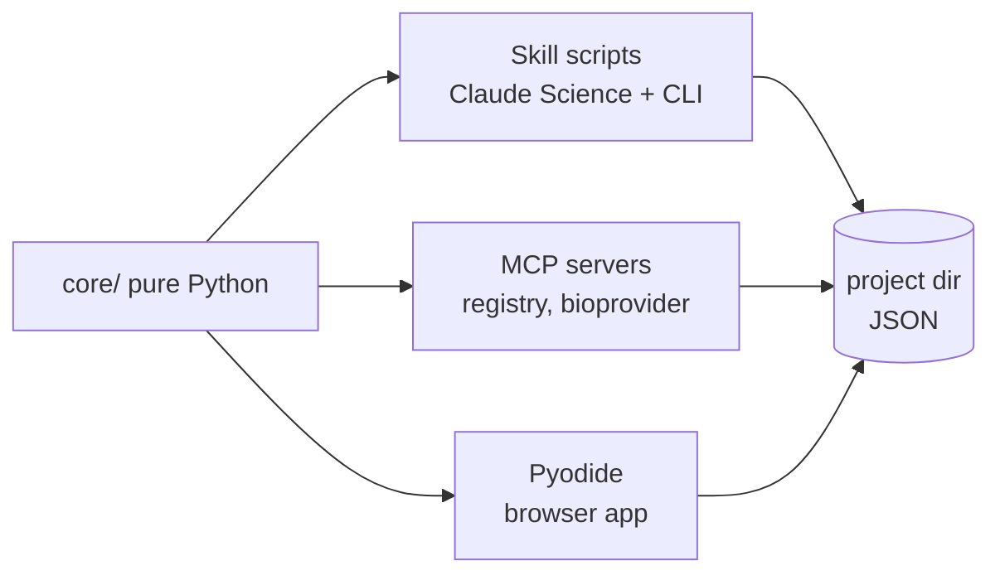
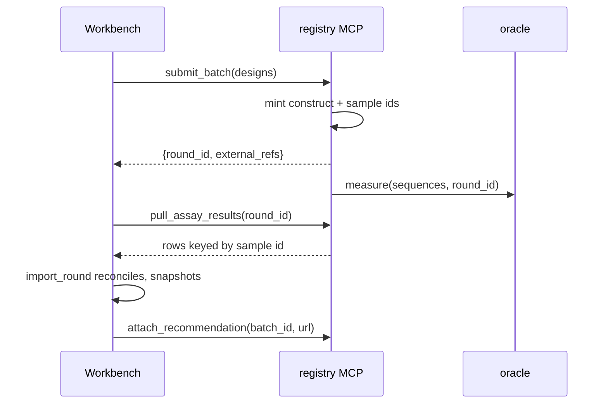

# Adaptive Optimization Workbench — One-Day Prototype Spec

2026-09-18 · @Someone

## Purpose and thesis

The prototype exists to show Anthropic one thing: Claude Science is a workbench for analyses, and the missing layer above it is **persistent decision state across experimental rounds**.

That layer is thin. It is a template that instantiates a project, a handful of skills that read and write that project's state, connectors that keep the LIMS authoritative, and a narrow surface for approving decisions instead of chatting about them.

**The proof artifact** is a single chart: cumulative best-observed binding affinity versus experimental round, model-guided selection against a random-selection baseline, on real measured data. Everything else makes that chart trustworthy and its decisions inspectable.

| Claim | Demonstrated by |
| --- | --- |
| The decision layer is thin and file-based, not another platform | Whole project state is a directory of JSON; the LIMS mock stays authoritative for samples and assays |
| The skills are real and portable, not demo mocks | The same `.py` files run in Claude Science, from the CLI, and in the deployed browser app |
| A specialized surface beats open-ended chat for this workflow | Batch review with approve and override, beside a chat panel that only explains |

Visibly absent, because the concept doc lists them as non-goals: sample management, plate design, hosted GPU, de novo generation, autonomous approval.

## The one-day architecture

Five decisions make this a one-day build. They are load-bearing — deviating from any of them adds hours.

**1. One core, three surfaces, zero servers.** The optimization logic lives in `core/` as plain Python. The skill scripts, the MCP servers, and the web app all call it. Nothing is implemented twice.



**2. The browser runs the real Python, via Pyodide.** This is the key move. The deployed site loads the identical `core/*.py` files through Pyodide and runs the actual surrogate fit and batch selection client-side. The site is fully static, works with no backend, no API key, and no cold start — and the pitch line "the same code runs in Claude Science and in this page" is literally true.

**3. Pure numpy, no scipy or scikit-learn.** An exact Gaussian process with an RBF kernel is about forty lines of numpy. Ridge regression is six. Avoiding the heavy wheels keeps Pyodide's first load near three seconds instead of thirty, and keeps the skill's dependency footprint trivial for Claude Science.

**4. Everything expensive is precomputed at build time.** The candidate space is finite and enumerable, so the full feature matrix and the oracle ship as static assets. Embeddings are genuinely from a protein language model; they are just computed once, offline, and committed.

**5. Synthetic-first, real data second.** The oracle sits behind an adapter. Claude Code builds the entire system against a generated landscape in the first hour, then swaps in the real dataset when the download and parse are done. A dataset problem at hour six cannot then sink the build.

Cut from the earlier plan: the local FastAPI service (Pyodide replaces it), the four-view UI (one page, three panels), the second working template (shipped as a visible stub), structure prediction (a stub tool that returns a cached result).

## Repo layout

One core module tree, three surfaces over it.

| Path | Contents |
| --- | --- |
| core/ | Pure numpy, shared by every surface: encode.py, surrogate.py, candidates.py, acquisition.py, scoring.py, schema.py |
| skills/adaptive-optimization/ | SKILL.md plus five thin CLI wrappers in scripts/ |
| mcp/ | registry\_server.py (LIMS stand-in), bioprovider\_server.py (Tamarind-shaped provider) |
| templates/ | antibody-affinity-maturation/, plus a stub second template |
| data/ | build\_oracle.py, build\_features.py, synthetic.py |
| web/ | Vite app, panels, and public/assets/ for the precomputed matrices |
| projects/demo-trastuzumab/ | A completed six-round project, committed to the repo |
| simulate\_campaign.py | Headless N-round run that emits the proof chart |

The web build step copies `core/*.py` into `web/public/core/` so Pyodide fetches the same files the skill executes. Claude Code must not port them to JavaScript — that fork is the one mistake that would undermine the whole demo.

## Data layer

The oracle answers exactly one question: given these sequences, what would the lab have reported? It sits behind an adapter so the build is never blocked on a download.

```python
# data/oracle.py
def measure(sequences, round_id):
    """-> [{sequence, affinity, replicate, censored, failed}]
    Injects lognormal assay noise, ~3% construct failure,
    left-censoring at the detection limit, and a per-round batch offset."""
```

The noise model is not decoration. It is what gives the import step real reconciliation work and what makes the calibration panel non-trivial. The per-round offset applies to every well in the round, controls included, which is what makes it recoverable from the controls rather than merely a nuisance.

**Units, fixed once.** The objective is pKD, the negative base-ten logarithm of the dissociation constant, so higher is better and the detection limit censors weak binders from below. Every value crossing a file boundary carries `unit: "pKD"`, and datasets reporting a dissociation constant in molar are converted at load. A sign error here points the entire proof chart downward, so the loader asserts the convention instead of trusting it.

Build against the synthetic landscape first and upgrade only if time allows.

| Priority | Dataset | Variants | Why |
| --- | --- | --- | --- |
| 0 | Synthetic landscape | any | NK-style with tunable epistasis; zero download risk; identical schema |
| 1 | [Absci trast-1](https://www.biorxiv.org/content/10.1101/2022.08.16.504181v1.full) | 8,932 | All variants with up to two mutations across eight positions of trastuzumab CDR-H3, ACE-assay affinity covering 97% of the combinatorial space |
| 2 | [AbCDR-Binding anti-fluorescein](https://zenodo.org/records/18762978) | 11,052 | Single and combinatorial mutants, continuous affinity, one CC-BY download |
| 3 | [AbCDR-Binding anti-HR2 SARS-CoV-2](https://zenodo.org/records/18762978) | 71,830 | Deeper combinatorial landscape if two-mutation depth saturates by round three |

Resolve the download and the license in the first hour with a single request, not at hour five. The swap itself is a one-file change; discovering at hour five that the file is gated is what sinks it.

**Objectives.** Affinity is the measured objective. The secondary objectives are deterministic in-silico scores computed by `core/scoring.py` on the same sequences: hydrophobicity, net charge, and liability motifs (NG deamidation, DG isomerization, unpaired cysteine). No public dataset measures affinity and developability over a single variant library, so do not fabricate assays to fill the gap.

The asymmetry is an asset, and it decides what each kind of objective is for. Affinity is uncertain, so it is optimized under a model. The computed scores are exact, so their thresholds are enforced as filters before optimization runs and whatever margin remains is a tie-break among candidates that already pass. The batch panel renders the difference visibly — wide uncertainty bars on affinity, none at all on the computed scores. Treating all three as objectives and multiplying a probability of satisfaction into the acquisition would be theatre, because that probability is always zero or one.

## The comparison

The chart is the claim, so the protocol behind it belongs in the spec rather than inside the script.

Two arms run over the same landscape, from the same round-1 seed batch, drawing from the same post-constraint candidate pool. Sharing the seed removes the luck of the first draw. Sharing the pool means the chart measures the model rather than the liability filter, which is a separate and much smaller claim.

| Element | Choice |
| --- | --- |
| Arms | Guided, and random from the feasible pool |
| Seeds | 20 independent runs per arm, plotted as median with an interquartile band |
| Round 1 | A diversity-maximizing seed batch, identical across arms and seeds |
| Budget | Identical per round, with controls and replicates counted against both arms |
| Threshold | The 99th percentile of the landscape, fixed before the first run |
| Headline metric | Cumulative best observed pKD, which is what the lab would report |
| Diagnostic metric | Cumulative best landscape pKD over the designs each arm chose |

One guided curve against one random curve is an anecdote, and this audience counts runs. Twenty seeds of six rounds is under a minute of numpy. Fixing the threshold before the first run is what separates a result from a number chosen after seeing the curve.

**Why two metrics.** Best-observed is the honest lab view and stays the headline. It is also a maximum over noisy reads, so a random arm can be flattered by one lucky well. The diagnostic line scores the same selections at the landscape value, before the simulated assay noise is added. On the real dataset that value is a published measurement, which makes the diagnostic a retrospective benchmark rather than privileged knowledge. On the synthetic landscape both lines are invented and the diagnostic is labelled as such.

Compute both in hour two. If they track each other, ship the single chart and the question never arises. If they diverge, the assay noise is large enough to convince a lab it has found a winner — a real result, one the calibration panel should carry, and far better found in hour two than on stage.

## Feature layer

One-hot is the default feature block and always ships. Embeddings are upside: real, from a real protein language model, computed exactly once at build time, and never on the critical path.

`data/build_features.py` loads ESM-2 (`esm2_t12_35M_UR50D`, roughly 150 MB) via HuggingFace transformers, mean-pools the final hidden layer over each full VH sequence, fits a 64-component PCA across the whole candidate space, and writes:

- `web/public/assets/features_onehot.bin` — float32, 8 positions by 20 amino acids, always present
- `web/public/assets/features_esm2_pca64.bin` — float32, one row per candidate, about 2.3 MB for 9,000 candidates, present only if the build ran
- `web/public/assets/oracle.bin` — landscape values, loaded only by the simulated lab

Use the 35M model, not 650M. It downloads in under a minute, runs 9,000 short sequences on a laptop CPU in minutes rather than hours, and PCA to 64 dimensions discards most of the difference anyway.

**Nothing depends on that build succeeding.** The second recipe is a Gaussian process on the first 64 principal components of whichever feature block is active, and the default block is one-hot. If the embeddings build, they become a second block and a second row in the bake-off. Every model run records the block it used and the interface prints it. This keeps an hour of download and inference friction off the critical path, for a recipe the next paragraph expects to lose.

**Expect one-hot to win, and make that a feature.** Over eight positions with at most two mutations, a one-hot ridge model will likely beat PCA-reduced embeddings. The FLAb2 benchmark found that with enough data a fine-tuned one-hot encoding model can match fine-tuned billion-parameter pretrained models. So the model registry fits both recipes each round and selects on held-out calibrated performance, and the UI shows which recipe won. A product that picks the simple model when the simple model wins is more credible to this audience, not less.

## The skill pack

One skill, five scripts. Every script takes a project directory and writes back into it. No script talks to the network. This is what makes the skill droppable into Claude Science and runnable under Pyodide without modification.

`SKILL.md` frontmatter carries `name: adaptive-optimization` and a description that fires on antibody or protein lead optimization, design-test-learn rounds, and batch selection. The body is short: the project state contract, when to call each script in sequence, and three rules the agent must not break — never change objectives without explicit approval, never pool measurements across assay versions without a bridging set, never invent a model recipe outside the registry.

| Script | Reads | Writes | Does |
| --- | --- | --- | --- |
| import\_round.py | a results CSV | evidence/snapshot\_NNN.json | Reconciles returned measurements to designs, checks units, bridges assay versions through the shared controls, keeps censored wells as censored, averages replicates, hashes the result into an immutable manifest |
| fit\_surrogates.py | all snapshots | models/run\_NNN.json | Fits every registered recipe, cross-validates, computes calibration (coverage of the 80% interval), picks the winner, stores predictions for the whole candidate pool |
| generate\_candidates.py | objectives.json | candidates/pool\_NNN.json | Enumerates variants inside the editable region under the mutation budget, applies hard constraints and liability filters, reports how many were removed and why |
| select\_batch.py | pool + model run | batches/batch\_NNN.json | Constrained selection with an explicit diversity term, plus controls and replicates, with per-design rationale and an extrapolation flag |
| evaluate\_prior.py | batch N-1 + snapshot N | batches/batch\_NNN.eval.json | Compares predictions for the designs actually approved against what came back, reports calibration drift and realized improvement against the random baseline |

**Model registry.** Two recipes only. `ridge_onehot` is ridge regression on one-hot features, read as Bayesian linear regression so the predictive variance is analytic. `gp_pca64` is an exact Gaussian process with an RBF kernel on the first 64 principal components of the active feature block, fit by grid search over two hyperparameters against the marginal likelihood. Both are under fifty lines of numpy. Only affinity is measured, so there is exactly one surrogate per round and the bake-off is between recipes rather than across objectives.

Censored wells enter the fit at the detection limit, carrying a flag. That biases them slightly upward and is the boring choice; the alternative is a Tobit likelihood and it is not worth the hour. Record the choice and surface the flag in the batch table.

**Acquisition.** The hard thresholds are already gone by this point: `generate_candidates` removed every candidate that failed one and reported the count and the reason. What survives is scored by expected improvement on affinity, then selected greedily with a diversity penalty on sequence distance to members already chosen, breaking ties toward the better developability margin.

Every batch carries the same controls: the parent, two designs from the previous batch as replicates, and two deliberately high-uncertainty designs. The first three exist so that round-to-round offsets are estimable rather than merely suffered. The last two are the visible difference between exploitation and information gathering, and the UI labels them.

Batch size is inclusive. A batch of 48 is 42 fresh picks plus the six control, replicate, and exploration slots, so the number of wells is the number the scientist set. The random arm spends the same budget the same way.

**Round 1 needs no sixth script.** With no model run on disk, `select_batch` has nothing to exploit, so it returns a diversity-maximizing seed batch over the feasible pool and says so in the rationale. That is the same code path, one branch deep, and it is the batch both arms of the comparison start from.

## Project state

A project is a directory. That is the whole persistence layer — no database, no server, and it means the skill, the MCP servers, and the browser are reading the same bytes.

```text
projects/demo-trastuzumab/
  project.json          lead, target, team, connected sources, template id
  objectives.json       properties, thresholds, batch size, mutation rules, editable region
  designs.json          sequence, hash, parent, mutation list, registry id
  evidence/snapshot_001.json ...
  models/run_001.json ...
  candidates/pool_001.json ...
  batches/batch_001.json, batch_001.eval.json ...
  rounds.json           the decision graph: which batch led to which snapshot led to which model
```

`rounds.json` is the artifact that matters. It is the thin longitudinal link from recommendation to tested constructs to returned evidence to updated model to next batch, and it is what the history panel renders. Everything else could be regenerated; this cannot.

**A batch record separates what was proposed from what was run.** `recommended` is what the optimizer returned, `approved` is what the scientist let through, and `overrides` records each removal with a note, an approver, and a timestamp. Usually the two lists are identical, and the demo project makes them differ on purpose. This is the governance claim in one file: the system proposes, a named person disposes, and the evaluation step scores predictions for what was actually tested.

Every snapshot, model run, and batch carries a content hash and the hashes of its inputs. Reproducibility in the demo is not a claim in a slide — click any batch and the UI walks back to the exact evidence that produced it.

Hashes are taken over canonical JSON: sorted keys, no insignificant whitespace, floats at fixed precision. Without that rule two surfaces produce two hashes for one decision and the lineage claim quietly stops being checkable. Fixed precision is also what keeps the hash stable across numpy under WebAssembly and numpy on a laptop, which will not agree in the last bits.

The concept doc names eight durable entities. Seven are implemented as files; one is deliberately reduced.

| Concept entity | Prototype | Reduced? |
| --- | --- | --- |
| Optimization project | project.json | No |
| Design | designs.json rows with sequence hash, parent, mutation list | No |
| External reference | the link table inside designs.json | No |
| Evidence snapshot | evidence/snapshot\_NNN.json, content-hashed | No |
| Objective specification | objectives.json, versioned on edit | No |
| Model run | models/run\_NNN.json | Fitted model artifact stored as coefficients, not a pickle |
| Recommendation batch | batches/batch\_NNN.json with rationale and overrides | No |
| Experimental round | rounds.json | No |

Feature and embedding lineage from the concept doc is recorded as a build hash on the feature assets rather than a full lineage graph. Say so if asked; it is the one place the prototype is thinner than the concept.

## Mock MCP servers

Two stdio servers built with FastMCP, about eighty lines each, both thin wrappers over `core/` and the project directory. They exist to make two boundary claims demonstrable rather than asserted.

**`registry_server.py` — the LIMS stand-in.** Tools: `list_designs`, `pull_assay_results(round_id)`, `get_construct(id)`, and `attach_recommendation(batch_id, report_url)`. The write path is deliberately crippled: it can attach a recommendation ID and a link to an existing record, and it cannot create samples, edit assay data, or drive a workflow. When someone asks in the demo whether this replaces Benchling, the answer is a tool list.

**`bioprovider_server.py` — the Tamarind-shaped provider.** Tools: `embed_sequences(model, sequences)`, `score_properties(tool_set, candidates)`, `predict_structures(model, complexes)`. Ship two backends behind one interface: `local` reads the precomputed PCA matrix, `esm_live` shells out to a real ESM-2 load. Swapping them is a one-line config change in `project.json`, which is the provider-independence claim made concrete. `predict_structures` returns a cached result with an honest note that structure prediction is stubbed.

Register both in `.mcp.json` at the repo root so the demo starts with one command.

## The round handoff

The simulated lab lives behind the registry server, not inside the workbench. `core/` must never import the oracle. This is what keeps the boundary claim honest: the workbench sees only what a lab reported, never ground truth.



The registry therefore exposes a fifth tool, `submit_batch(designs)`, alongside the four named above. It mints construct and sample identifiers in its own namespace, records the round as in flight, and returns only the external references — the workbench stores those links in `designs.json` and owns nothing about the samples themselves.

`pull_assay_results` returns rows shaped the way a real export is shaped, not the way the model wants them:

| Field | Note |
| --- | --- |
| sample\_id | The registry's identifier. Never the design id — reconciliation is the point |
| plate, well | Present so batch effects have somewhere to live |
| assay\_version | Changes at round 4 in the demo project, which forces the bridging path to fire visibly |
| value, unit | Raw assay units, not normalized |
| status | ok, failed, or censored\_low |
| replicate | Separate rows, not pre-averaged |

About 3% of rows come back failed and a few land below the detection limit. `import_round` joins on the external reference table, averages replicates, keeps censored values as censored rather than dropping them, and only then writes the snapshot.

**Version changes are bridged, not ignored.** The naive rule — never pool across assay versions — is correct, and it would also discard rounds 1 through 3 at exactly the moment the calibration panel is on screen. The batch composition already solves this. Every batch carries the parent and two replicates from the round before it, so consecutive rounds share designs, a per-round offset is estimable from them, and an assay version change is simply a larger offset. `import_round` fits it, records it on the snapshot along with the designs it came from, and pools only after correcting. If the bridging set is missing or its members disagree, it refuses to pool and says why. Refusing is the safe path; having a principled reason not to refuse is the better demo.

In the browser the same contract holds: the web app calls a Python shim with the identical signature instead of the MCP server. One code path, two transports.

## Template library

A template is a packaged optimization workflow: the unit that turns a general-purpose agent into a product surface. It is the answer to "why isn't this just a good prompt?"

A prompt describes a task once. A template declares, ahead of any conversation, what the objectives schema looks like, which constraints are enforced, which model recipes are permitted, how batches are composed, and which panels the interface renders. The scientist then supplies three facts about their lead. Everything downstream — what the skill reads, what the optimizer is allowed to do, what the UI shows — follows from the template rather than from how well someone phrased a request.

That is also what makes runs comparable. Two teams using the same template produce decision records with the same shape, so the calibration and improvement numbers mean the same thing across projects. An open-ended chat cannot give you that.

Templates are authored by whoever owns methodology for a group — a computational lead, or a vendor shipping a validated workflow. Scientists consume them. This is the same split as a validated assay protocol, and it is the reason the template library is a library rather than a settings page.

```json
{
  "id": "antibody-affinity-maturation",
  "lead": { "name": "trastuzumab", "chain": "VH", "editable_region": [98, 106] },
  "objectives": [
    { "name": "affinity", "direction": "maximize", "unit": "pKD", "source": "measured" },
    { "name": "hydrophobicity", "direction": "minimize", "threshold": 0.45, "source": "computed" },
    { "name": "liability_count", "direction": "minimize", "threshold": 0, "source": "computed" }
  ],
  "constraints": { "max_mutations": 2, "forbidden_motifs": ["NG", "DG", "C"] },
  "batch": { "size": 48, "controls": 2, "replicates": 2, "exploration_slots": 2 },
  "model_recipes": ["ridge_onehot", "gp_pca64"],
  "panels": ["setup", "batch_review", "progress"]
}
```

| The template fixes | The scientist supplies |
| --- | --- |
| Objective schema and which properties are measured vs computed | The lead sequence and target name |
| The constraint ruleset and forbidden motifs | The editable region and mutation budget |
| The allowed model recipes | Nothing — recipe selection is automatic and reported |
| Batch composition policy: controls, replicates and exploration slots, all counted inside the batch size | Batch size, within limits the template sets |
| Which panels render and in what order | Nothing |

**Lifecycle.** Browse the library, pick a template, fill three fields, and a project directory exists with `project.json`, `objectives.json`, and an empty round history. From that moment the skill scripts, the MCP servers, and the web panels all read the same declarations. `project.json` records the template id and version, so a project keeps working when the template later changes.

**What a template is not.** It is not a prompt, not a saved chat, and not a config file for the model. Nothing in it is advisory — the constraint ruleset is enforced by `core/candidates.py` before optimization runs, and a recipe absent from the template's list cannot be fitted even if the agent asks for it.

In the prototype, ship one working template and one stub. The stub exists in the picker, greyed out, purely so the audience sees that the abstraction is not single-purpose. Building it would cost an hour and prove nothing further.

## Web app

Vite plus React, static output, deployed to a default Netlify URL. One page, three panels, a persistent round timeline across the top. No router, no state library, no backend.

On load: fetch the template list, load the committed demo project's state, boot Pyodide with numpy, fetch `core/*.py` into the Pyodide filesystem, fetch the three binary assets into numpy arrays. Show a progress line while this happens — it takes a few seconds and pretending otherwise looks broken.

Pin the Pyodide version and serve the runtime and the numpy wheel from the site's own origin. A demo that depends on a third-party CDN and conference wifi at the same moment has a coin flip in it.

**Panel 1, Setup.** Renders `objectives.json` as editable controls: editable region, mutation budget, per-objective direction and threshold, batch size. Collapsed by default once a project has rounds. Editing writes a new objectives version and marks downstream model runs stale, which is a small detail that says a lot about the product.

**Panel 2, Batch review.** The centerpiece. A table of the 48 selected designs with mutations, predicted value and interval per objective, selection rationale, and a badge for controls, replicates, and exploration picks. Beside it a Pareto scatter of predicted affinity against the developability score, with tested designs in one style and proposed ones in another. Every row has a checkbox and an override note field. One Approve button.

**Panel 3, Progress.** Two charts. The proof chart — cumulative best observed pKD by round, model-guided against the random baseline's median and interquartile band. And calibration — predicted against observed for the previous batch, with the 80% interval coverage printed as a number.

**The interactive loop, entirely in-browser.** Approve a batch, and the app calls the simulated lab, runs `import_round`, `fit_surrogates`, `generate_candidates`, and `select_batch` through Pyodide, then re-renders with round N+1 proposed. Two to four seconds. This is what makes the deployed site demonstrable on its own: a visitor with no key and no install runs real rounds of real optimization.

Rounds a visitor runs live in the Pyodide filesystem and in `localStorage`, so a reload keeps their progress and Reset clears it. Nothing is written back to the repository, and the page says so. The browser reads a committed copy of the project at load and owns its own bytes afterwards — worth stating plainly rather than letting someone work it out. The oracle also ships in the bundle, because the simulated lab has to run client-side, so anyone can download ground truth. Say that first. The claim is that `core/` never reads it, and that is checkable by reading six files.

Ship the committed demo project at round three so a visitor lands mid-campaign with history already visible, and can run rounds four through six themselves. A Reset link restores it.

## The explain panel

One Netlify function, `/api/explain`. It takes the current batch JSON plus the last model run and a question, sends them to Claude with a short system prompt, and streams back prose. It is read-only — it never writes project state, which is the governance point made structural rather than promised.

Questions it should handle well: why was this design selected, what is the model uncertain about, what changed since the last round, why was this candidate filtered out.

Guard it: cap at roughly 400 output tokens, hold the key in a Netlify environment variable, and add a simple per-session request cap so a public URL cannot run up a bill. If `ANTHROPIC_API_KEY` is absent, the panel falls back to rendering the rationale strings that `select_batch.py` already wrote into the batch file, labelled as precomputed. The site then still works end to end for anyone who forks it.

Build this last. It is the most impressive-to-least-essential ratio in the whole spec, and the demo survives without it.

## Build order

Run these as separate Claude Code sessions with a clean context each. The gate at hour 3 is real: if the proof chart does not separate, stop and fix the science before building any interface.

There is a second gate at hour 5. If Claude Code cannot complete a round through the skill and the connectors alone, the packaging claim fails, and that is worth an hour taken from the web app.

| Phase | Deliverable | Done when |
| --- | --- | --- |
| 1 | Repo skeleton, synthetic oracle, project schema, one-hot encoder, dataset licence check | A project directory can be created from the template and round 1 designs written |
| 2 | core/ surrogate, candidates, acquisition, plus simulate\_campaign.py | GATE: twenty seeds per arm, guided reaches the pre-registered threshold in fewer rounds, and the interquartile bands separate |
| 3 | The five skill scripts and SKILL.md wrapping core/ | The same six rounds run through the CLI scripts, not just the library |
| 4 | Both MCP servers, .mcp.json, one end-to-end run driven by Claude Code | Claude Code completes a round using only skill and connector calls |
| 5 | Real data swap, then the ESM-2 feature build if the hour holds | Real measured affinities, and real embeddings only as upside |
| 6 | Web app: Pyodide boot, three panels, the approve loop | Approving a batch advances the round in-browser in under five seconds |
| 7 | Committed demo project at round 3, Netlify deploy, README | The public URL runs a round from a cold visit with no key |
| 8 | The explain panel | Works with a key, degrades cleanly without one |
| 9 | Demo script, five-minute rehearsal, cut anything broken | You can run it start to finish without apologising |

## Acceptance and demo script

**Acceptance criteria.** Seven in total, and all seven are testable.

1. `simulate_campaign.py` produces a chart where guided selection reaches the pre-registered threshold in measurably fewer rounds than random, over twenty seeds per arm.
2. Claude Code, given only the skill and the two MCP servers, completes one full round unaided.
3. The deployed URL, opened cold in a private window with no key, runs a round to completion.
4. Clicking any batch reaches the exact evidence snapshot hash that produced it.
5. The registry connector cannot create a sample — demonstrable by reading its tool list.
6. Switching the provider backend from `local` to `esm_live` changes no code outside `project.json`. This one is CLI-only; the live backend cannot run in the browser, and the README says so.
7. The CLI and the browser, given the same project state, select the same batch and print the same batch hash.

**Five-minute demo.**

1. **Thirty seconds.** Template picker. Pick antibody affinity maturation, name the lead, and a project exists. This is the part Claude Science has no answer for today.
2. **One minute.** Setup panel. Editable region, mutation budget, three objectives, batch of 48. Note that affinity is measured and the rest are computed, and that the optimizer treats them differently.
3. **Ninety seconds.** Batch review. Walk three rows: a high-confidence exploit pick, a high-uncertainty exploration pick, and a design that was filtered out for a liability motif. Override one, add a note, approve.
4. **One minute.** The round advances live. Calibration updates. The proof chart extends. Say the number: fewer rounds to threshold than random.
5. **One minute.** Drop to the terminal. Same round, same files, run through Claude Code with the skill and connectors. Put the two batch hashes side by side; they match. The web app was never the product — it is one surface over a decision layer that also works as a skill.

That last beat is the whole pitch, so protect the time for it.

## Risks and cutlines

**The landscape saturates.** With at most two mutations across eight positions, the best variant may be found by round two and the proof chart flattens. Check this in hour two, not hour nine. Mitigations in order: shrink the batch to 24, start the campaign from a deliberately mediocre seed set rather than a random one, or move to the 71,830-variant SARS-CoV-2 set.

**Pyodide is slower than expected.** Exact GP inference is cubic in observations; by round six with 48 per round that is a 288-by-288 solve, which is nothing. If the boot is the slow part, drop to numpy-only Pyodide and lazy-load. If it is genuinely unworkable, the fallback is precomputing all six rounds and having the approve button step through them — the loop looks identical and only you know the difference. Do not take that fallback before hour nine.

**Dataset download fails or the license is unclear.** Ship synthetic, say so plainly in the README and on the page, and move on. A clearly labelled synthetic landscape costs less credibility than a vague provenance claim.

**The two metrics disagree.** If best-observed and best-landscape diverge, assay noise is doing work the model is not. Do not quietly adopt the flattering one. Show the diagnostic, say the noise level out loud, and let the calibration panel carry it. An audience that catches you choosing a metric stops believing the chart.

**Scope creep into the LIMS.** The moment Claude Code starts writing sample or plate models, stop it. The absence is the argument.

**Cut in this order if the day runs short:** the explain panel, the second template stub, the Pareto scatter (keep the table), the override note field. The ESM-2 build is not on this list because it is not on the critical path — build it if hour 5 is free, skip it otherwise. Never cut: the proof chart, the approve loop, the CLI path through the skill.

## What is real and what is staged

This audience will ask. Put this table in the README and be able to recite it, because the credibility cost of being caught dressing up a mock is far higher than the cost of admitting a stub.

| Component | Status |
| --- | --- |
| Surrogate fitting, calibration, constraint filtering, batch acquisition | Real. Runs on every round, in the browser and the CLI |
| Measured affinity values | Real published experimental data, if the dataset swap lands. Clearly labelled synthetic otherwise |
| Sequence embeddings | Real ESM-2, computed once offline and reduced to 64 dimensions, if the build ran. One-hot otherwise, and the interface names the block in use |
| Developability and liability scores | Real deterministic calculations, not assay measurements, labelled as computed throughout the UI |
| The wet lab | Staged. An oracle behind the registry server replays measured values with added noise, failures, and censoring |
| The LIMS | Staged. A mock server with a deliberately narrow write path |
| Structure prediction | Stubbed. Returns a cached result and says so |
| Managed provider execution | Interface is real and swappable; only the local backend is wired by default |
| Rounds run in the browser | Real. The same Python, on state held in the browser and never written back to the repository |
| The proof chart's diagnostic line | Real published measurements on the real dataset. Invented, and labelled so, on the synthetic one |

The framing for the demo: everything about the decision loop is real, and everything about the laboratory is replayed.

## Packaging for Claude Science

The skill and connectors should be installable, not merely described. Anthropic publishes a life-sciences marketplace of MCP servers and skills for Claude Code, so mirror that shape: a `marketplace.json` at the repo root declaring one plugin that bundles the `adaptive-optimization` skill and both MCP servers, plus a README section giving the one command to add it.

The test that matters is criterion 2 in the acceptance list: someone installs the plugin, points it at a project directory, and completes a round by conversation alone. If that works, the claim that this is an extension of Claude Science rather than a separate application is demonstrated rather than argued.

Keep `SKILL.md` under 150 lines. The scripts carry the procedure; the skill body carries only the state contract, the call order, and the three rules the agent must not break.
